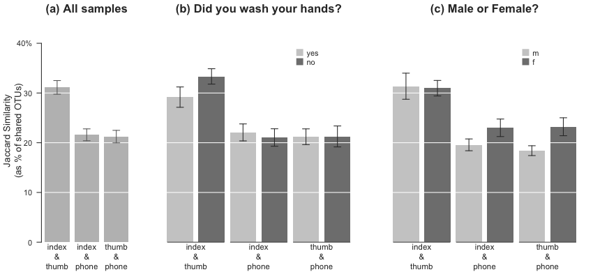

# Phone Microbiome Pilot Project
#### James Meadow (jfmeadow at gmail dot com)
-------------------------
### Getting data into shape

The first step is to load two necessary community ecology packages, 
and then load a few custom functions that will be used later. 


```r
library(vegan)
```

```
## Loading required package: permute
## Loading required package: lattice
## This is vegan 2.0-10
```

```r
library(labdsv)
```

```
## Loading required package: mgcv
## Loading required package: nlme
## This is mgcv 1.7-28. For overview type 'help("mgcv-package")'.
## Loading required package: MASS
## 
## Attaching package: 'labdsv'
## 
## The following object is masked from 'package:stats':
## 
##     density
```

```r
# library(dplyr)
library(xtable)

# setwd('~/Dropbox/rwjf/Meadow_etal_Phones/') # not necessary for knitr -
# automatically in dir.  load('phones.RData')
source("functions.R")
```


The OTU table is brought in with a custom function `QiimeIn` that reads a classic OTU table and then splits it into a few useful pieces in a big list. The Bioconductor package `phyloseq` actually has more efficient ways to do this with the `.biom` format, but my function will work here - the outcome is identical in this 
case. 


```r
rw.list <- QiimeIn(file = "phones_otu_table.txt")
rw.map <- read.delim("phones_map.txt", head = TRUE, row.names = 1)  # removed comment character from first line. 
rw.big <- rw.list$Table
rw.taxo <- rw.list$Taxa
rm(rw.list)
```


Next, the OTU table needs to be put into shape. R wants to see letters, not numbers, as row names, so a big X is inserted. Remove this. 
We found a total of 3.2078 &times; 10<sup>6</sup> sequences, consisting of 56 samples and 34400 OTUs, defined at 97% sequence similarity. 
Then line up with the order of the mapping file. 


```r
# OTU table
row.names(rw.big) <- gsub("X", "", row.names(rw.big))
rw.big <- rw.big[row.names(rw.map), ]
```


-----------

Before anything else, we should remove any OTUs from lab controls that showed up in experiment samples. Cell phone surfaces hold really low biomass, so amplification contamination is inevitable. Best to just remove them all. Save the list of contaminant OTUs to shore up the taxonomy table below. 


```r
cont <- grep("cont", row.names(rw.map))
cont.table <- rw.big[cont, ]
cont.otus <- which(colSums(cont.table) > 0)

rw.table.nocontrol <- rw.big[-cont, -cont.otus]
sort(rowSums(rw.table.nocontrol))
```

```
## 20.phone 22.phone 31.phone 29.phone 30.phone 35.index 26.thumb 35.phone 
##     2719     4142     4612     5425     6356     6863     7952     8286 
## 20.thumb 20.index 28.index 19.phone 18.index 18.phone 25.phone 26.phone 
##     9362    10023    10417    10834    10972    11022    11800    12105 
## 17.phone 34.phone 29.index 30.index 30.thumb 35.thumb 18.thumb 17.thumb 
##    12348    12730    13474    13898    14052    14241    14286    14833 
## 34.thumb 29.thumb 34.index 28.phone 32.index 22.index 33.thumb 25.thumb 
##    15015    15392    16022    16946    17051    17250    17290    17543 
## 33.phone 25.index 26.index 33.index 17.index 23.phone 19.index 32.thumb 
##    18673    18991    19741    19751    20257    20379    20920    20949 
## 32.phone 31.index 23.thumb 22.thumb 19.thumb 23.index 31.thumb 24.phone 
##    20976    21406    21747    25087    27009    27196    29835    30507 
## 28.thumb 24.thumb 24.index 
##    31828    32916    34054
```

```r
rm(rw.big, cont.table, cont)
```


Next:

* Plant sequences are always in 16S datasets, so one way to remove them is to call them by name "_Streptophyta_." These get removed.
* Remove lab contaminants identified above.  
* Remove OTUs that are represented by only 1 or 2 sequences - these lend little to community analysis and slow down the whole works. 
* The last step is to rarefy all samples to an even sampling depth, in this case 2500 sequences per sample.


```r
rw.taxo <- rw.taxo[-cont.otus, ]
streptophyta <- grep("Streptophyta", rw.taxo$taxa.names)
rw.table.tmp <- rw.table.nocontrol[, -c(streptophyta)]
sort(rowSums(rw.table.tmp))
```

```
## 20.phone 22.phone 31.phone 29.phone 30.phone 35.phone 35.index 20.thumb 
##     2691     4034     4576     5399     5568     6034     6792     7158 
## 26.thumb 20.index 28.index 18.phone 19.phone 18.index 25.phone 17.phone 
##     7252     9276     9598    10520    10826    10893    11698    11709 
## 30.index 30.thumb 26.phone 34.phone 29.index 18.thumb 35.thumb 17.thumb 
##    11921    11928    12088    12726    13366    14167    14203    14809 
## 34.thumb 29.thumb 34.index 28.phone 32.index 22.index 33.thumb 25.thumb 
##    14985    15327    15984    16880    17036    17109    17111    17516 
## 33.phone 25.index 26.index 33.index 17.index 23.phone 19.index 32.thumb 
##    18645    18952    19328    19703    20209    20293    20881    20909 
## 32.phone 31.index 23.thumb 24.phone 22.thumb 19.thumb 23.index 31.thumb 
##    20966    21229    21731    23113    24969    26973    27169    29794 
## 28.thumb 24.thumb 24.index 
##    30007    32768    33938
```

```r
rw.table.tmp <- rw.table.tmp[, -c(which(colSums(rw.table.tmp) < 3))]
```


```r
rw.25 <- rrarefy(rw.table.tmp, 2500)
rm(streptophyta, rw.table.tmp, cont.otus)
```


Since lots of OTUs were removed from the OTU table, we remove them from the taxonomy table - we will want everything lined up downstream. 


```r
# taxonomy
rw.taxo.25 <- rw.taxo[colnames(rw.25), ]
rm(rw.taxo)
```


So we're left with 1.275 &times; 10<sup>5</sup> sequences in 51 samples and 9681 OTUs. 

------------------

The mapping file (metadata for each sample) was loaded in during the first step. 
First, we line up samples with the OTU table row names since it is now in shape. Then there is lots of baggage that comes along with mapping files. Factor variables must be retrained, and then we add three colors that will be used in analysis. 


```r

# mapping file
map <- rw.map[row.names(rw.25), ]
rm(rw.map)
map$individ <- factor(map$individ, levels = c(as.character(levels(map$individ)[1:17])))
map$location <- factor(map$location, levels = c("index", "thumb", "phone"))
map$type <- factor(map$type, levels = c("c", "o", "p"))
map$dominance <- factor(map$dominance, levels = c("r", "l"))
map$gender <- factor(map$gender, levels = c("f", "m"))
map$wash <- factor(map$wash, levels = c("y", "n"))
map <- map[, c(3, 5, 7, 8, 9)]
map$bg <- "gray30"  # phones
map$bg[map$location == "index"] <- "cornflowerblue"
map$bg[map$location == "thumb"] <- "darkorange"
```


### Generate taxonomy figure

Taxonomy information, as QIIME gives it, is pretty useless raw. So we have to parse this into a workable data frame, and then use that for figures. First, rename and save on typing! Then the separation between taxonomic levels is used to split strings. A couple more steps and then we have a data frame with 7 taxonomic levels and one last column for total abundance across the rarefied dataset. 


```r
tt <- rw.taxo.25
tt2 <- as.character(gsub('[[:alpha:]]{1,1}\\_\\_', '', tt$taxa.names))
tt3 <- strsplit(tt2, split='; ')
ttl <- unlist(lapply(tt3, length))

tt4 <- data.frame(
  kingdom=sapply(tt3, function(x){x[1]}),
  phylum=sapply(tt3, function(x){x[2]}),
  class=sapply(tt3, function(x){x[3]}),
  order=sapply(tt3, function(x){x[4]}),
  family=sapply(tt3, function(x){x[5]}),
  genus=sapply(tt3, function(x){x[6]}), 
  species=sapply(tt3, function(x){x[7]}))

tt4$kingdom <- as.character(tt4$kingdom)
tt4$phylum <- as.character(tt4$phylum)
tt4$class <- as.character(tt4$class)
tt4$order <- as.character(tt4$order)
tt4$family <- as.character(tt4$family)
tt4$genus <- as.character(tt4$genus)
tt4$species <- as.character(tt4$species)

for (i in 1:ncol(tt4)){
	tt4[which(is.na(tt4[, i])), i] <- '' 
	} # warning suppressed

taxo <- tt4
taxo$abundance <- colSums(rw.25)
row.names(taxo) <- rw.taxo.25$qiime.id
rm(tt, tt2, tt3, ttl, tt4)

head(taxo)
```

```
##     kingdom         phylum               class             order
## 3  Bacteria Proteobacteria Gammaproteobacteria   Pseudomonadales
## 11 Bacteria Proteobacteria Gammaproteobacteria Enterobacteriales
## 16 Bacteria    Tenericutes          Mollicutes Acholeplasmatales
## 30 Bacteria Planctomycetes      Planctomycetia        Gemmatales
## 31 Bacteria     Firmicutes          Clostridia     Clostridiales
## 42 Bacteria    Chloroflexi               C0119                  
##                family         genus    species abundance
## 3       Moraxellaceae Enhydrobacter aerosaccus         0
## 11 Enterobacteriaceae                                  1
## 16 Acholeplasmataceae  Acholeplasma                    0
## 30     Isosphaeraceae                                  4
## 31    Veillonellaceae     Dialister                  243
## 42                                                     3
```


Looks good. Then we want to know about the most abundant phyla, to be used for a taxonomy figure. 


```r
ph <- aggregate(taxo$abundance, by = list(taxo$phylum), FUN = sum)
ph[rev(order(ph$x)), ]  #  cut off at unidentified.
```

```
##             Group.1     x
## 15       Firmicutes 46803
## 21   Proteobacteria 33082
## 4    Actinobacteria 25776
## 6     Bacteroidetes 12458
## 16     Fusobacteria  4097
## 1                    3608
## 11    Cyanobacteria   330
## 25      Tenericutes   297
## 2          [Thermi]   219
## 3     Acidobacteria   206
## 20   Planctomycetes   194
## 9       Chloroflexi    82
## 23              SR1    79
## 28  Verrucomicrobia    74
## 17 Gemmatimonadetes    62
## 22     Spirochaetes    52
## 24    Synergistetes    34
## 18             GN02     7
## 13              FBP     7
## 7        Chlamydiae     7
## 10    Crenarchaeota     6
## 5   Armatimonadetes     6
## 26              TM6     5
## 27              TM7     4
## 29            WPS-2     2
## 12    Euryarchaeota     2
## 19      Nitrospirae     1
## 14    Fibrobacteres     0
## 8          Chlorobi     0
```


We can use the top 5 and group all others. So a new data frame is created to hold the mean abundances grouped by phylum and by location type (index, thumb, or phone). This code is not pretty but it works.


```r
ph.mean <- data.frame(
  Firmicutes = aggregate(rowSums(rw.25[, which(taxo$phylum == 'Firmicutes')]), 
    by=list(map$location), FUN=mean),
	Proteobacteria = aggregate(rowSums(rw.25[, which(taxo$phylum == 'Proteobacteria')]), 
    by=list(map$location), FUN=mean),
	Actinobacteria = aggregate(rowSums(rw.25[, which(taxo$phylum == 'Actinobacteria')]), 
    by=list(map$location), FUN=mean),
  Bacteroidetes = aggregate(rowSums(rw.25[, which(taxo$phylum == 'Bacteroidetes')]), 
    by=list(map$location), FUN=mean),
	Fusobacteria = aggregate(rowSums(rw.25[, which(taxo$phylum == 'Fusobacteria')]), 
    by=list(map$location), FUN=mean),
	Other = aggregate(rowSums(rw.25[, -c(which(taxo$phylum %in% 
		c('Firmicutes', 'Proteobacteria', 'Actinobacteria', 'Fusobacteria', 'Bacteroidetes')))]), 
		by=list(map$location), FUN=mean))

ph.mean <- ph.mean[, c(2, 4, 6, 8, 10, 12)]
row.names(ph.mean) <- c('index', 'thumb', 'phone')
names(ph.mean) <- gsub('.x', '', names(ph.mean))
ph.mean <- ph.mean/2500
```


Then the same thing is done, but to generate standard errors for bar graph error bars. It is the same big ugly code chunk, but FUN=sd is used as the final arguement. SE must be calculated by hand in r, so there is one extra step, and then they are reversed so the big bars are on top in descending order.


```r
se <- function(x) {sd(x)/sqrt(length(x))}
rw.25.rel <- rw.25/2500

ph.se <- data.frame(
	Firmicutes = aggregate(rowSums(rw.25.rel[, which(taxo$phylum == 'Firmicutes')]), 
    by=list(map$location), FUN=se),
	Proteobacteria = aggregate(rowSums(rw.25.rel[, which(taxo$phylum == 'Proteobacteria')]), 
    by=list(map$location), FUN=se),
	Actinobacteria = aggregate(rowSums(rw.25.rel[, which(taxo$phylum == 'Actinobacteria')]), 
    by=list(map$location), FUN=se),
	Bacteroidetes = aggregate(rowSums(rw.25.rel[, which(taxo$phylum == 'Bacteroidetes')]), 
    by=list(map$location), FUN=se),
  Fusobacteria = aggregate(rowSums(rw.25.rel[, which(taxo$phylum == 'Fusobacteria')]), 
    by=list(map$location), FUN=se),
	Other = aggregate(rowSums(rw.25.rel[, -c(which(taxo$phylum %in% 
		c('Firmicutes', 'Proteobacteria', 'Actinobacteria', 'Fusobacteria', 'Bacteroidetes')))]), 
		by=list(map$location), FUN=se))
ph.se <- ph.se[, c(2, 4, 6, 8, 10, 12)]
row.names(ph.se) <- c('index', 'thumb', 'phone')
names(ph.se) <- gsub('.x', '', names(ph.se))
rm(rw.25.rel)
```


And then turn them upside down for nicer plotting. 


```r
ph.mean <- ph.mean[, c(6:1)]
ph.se <- ph.se[, c(6:1)]
```


Now we have data in place to make a barplot by hand: 


```r
par(mar = c(5, 7, 2, 2), las = 1, font.lab = 1)
mids <- barplot(as.matrix(ph.mean), beside = TRUE, horiz = TRUE, las = 1, xlim = c(0, 
    0.6), border = "white", xlab = "", axisnames = FALSE, col = c("cornflowerblue", 
    "darkorange", "gray30"), xaxt = "n", font.lab = 2)
abline(v = c(seq(0.1, 0.6, 0.1)), col = "white", lwd = 0.5)
arrows(unlist(c(ph.mean - ph.se)), unlist(c(mids)), unlist(c(ph.mean + ph.se)), 
    unlist(c(mids)), code = 3, angle = 90, length = 0.01)
axis(1, at = c(0, 0.1, 0.2, 0.3, 0.4, 0.5, 0.6), labels = c(0, 10, 20, 30, 40, 
    50, 60))
legend(0.4, 7, legend = c("phone", "thumb", "index"), pch = 15, pt.cex = 2, 
    col = c("gray30", "darkorange", "cornflowerblue"), bty = "n", y.intersp = 0.82)
mtext("Percent of Each Sample", side = 1, line = 2.4, font = 2)
mtext(names(ph.mean), side = 2, at = c(mids[2, ]), line = 0.2, font = 3)
```

 

```r
# mtext('Phylum-level abundance', col='gray30')
```


### Barplots - how are phones related to people?

Next, we want to know how communities break out between people and their phones. To do this, we make a distance matrix. In our case, we want to be able to easily explain so we use Jaccard similarity ($latex S_{jaccard} = \frac{shared~richness}{combined~richness}$) so that we can interpret in easy language. Later, we'll also want a _similarity_ rather than a _distance_, so we'll invert the distance R gives by default ($latex S_{jaccard} = 1-D_{jaccard}$). This way things with more in common have higher values, and that is easier to visualize.


```r
dis <- vegdist(rw.25, "jaccard")
```


Since we want to do this several times, I'll package a few tedious routines into functions to cut down on repetative coding. First set up a data frame for the whole dataset. 


```r
bar.df <- data.frame(matrix(0, 17, 3))
names(bar.df) <- c("in.th", "in.ph", "th.ph")
row.names(bar.df) <- unique(map$individ)
```


Then create the functions that will be used a few times.


```r
makeBarDF <- function() {
  for(i in 1:nrow(bar.df)) {
  bar.df[i, 1] <- as.matrix(dis)[which(map$individ == row.names(bar.df)[i] &
								   		 map$location == 'index'), 
								   which(map$individ == row.names(bar.df)[i] & 
								   		 map$location == 'thumb')]
	bar.df[i, 2] <- as.matrix(dis)[which(map$individ == row.names(bar.df)[i] &
								   		 map$location == 'index'), 
								   which(map$individ == row.names(bar.df)[i] & 
								   		 map$location == 'phone')]
	bar.df[i, 3] <- as.matrix(dis)[which(map$individ == row.names(bar.df)[i] &
								   		 map$location == 'thumb'), 
								   which(map$individ == row.names(bar.df)[i] & 
								   		 map$location == 'phone')]
  }
  invisible(bar.df)
}

makeBarSummary <- function(bar.df=bar.df) {
  bar.summary <- data.frame(cbind(apply(bar.df, 2, mean), 
					 	       (apply(bar.df, 2, sd)/sqrt(nrow(bar.df)))))
  bar.summary[, 3] <- bar.summary[, 1]-bar.summary[, 2]
  bar.summary[, 4] <- bar.summary[, 1]+bar.summary[, 2]
  names(bar.summary) <- c('mean', 'se', 'se.lo', 'se.hi')
  invisible(bar.summary)
}
```


And then run the data set through the functions. 


```r
bar.jac.df <- makeBarDF()
bar.jac <- makeBarSummary(bar.df = bar.jac.df)

bar.jac.df
```

```
##     in.th  in.ph  th.ph
## 17 0.5795 0.7946 0.8044
## 18 0.5524 0.8631 0.7820
## 19 0.6512 0.7130 0.6800
## 20 0.6428 0.7380 0.8312
## 22 0.6176 0.8177 0.7949
## 23 0.5755 0.6856 0.7670
## 24 0.5061 0.8090 0.7899
## 25 0.6431 0.7721 0.7618
## 26 0.7316 0.7745 0.8279
## 28 0.7531 0.8579 0.9718
## 29 0.5393 0.7255 0.7281
## 30 0.4958 0.8901 0.8854
## 31 0.8126 0.8274 0.8812
## 32 0.7067 0.6790 0.5706
## 33 0.6049 0.7386 0.6702
## 34 0.6115 0.8024 0.7679
## 35 0.8987 0.8558 0.9266
```

```r
bar.jac
```

```
##         mean      se  se.lo  se.hi
## in.th 0.6425 0.02638 0.6161 0.6689
## in.ph 0.7850 0.01555 0.7694 0.8005
## th.ph 0.7906 0.02370 0.7669 0.8143
```


Each additional time, we're only interested in a few samples at a time, so run subsets through the same functions. Each starts out being named generically `bar.df`, but then each object gets put into a uniquely named data frame.

First we need to know how many are in each group.


```r
table(map$gender)/3
```

```
## 
##  f  m 
## 10  7
```

```r
table(map$wash)/3
```

```
## 
## y n 
## 9 8
```

```r

# females=10
bar.df <- data.frame(matrix(0, 10, 3))
names(bar.df) <- c("in.th", "in.ph", "th.ph")
row.names(bar.df) <- unique(map$individ[which(map$gender == "f")])
bar.df.female.j <- makeBarDF()
bar.female.j <- makeBarSummary(bar.df = bar.df.female.j)

# males=7
bar.df <- data.frame(matrix(0, 7, 3))
names(bar.df) <- c("in.th", "in.ph", "th.ph")
row.names(bar.df) <- unique(map$individ[which(map$gender == "m")])
bar.df.male.j <- makeBarDF()
bar.male.j <- makeBarSummary(bar.df = bar.df.male.j)

# yes wash=9
bar.df <- data.frame(matrix(0, 9, 3))
names(bar.df) <- c("in.th", "in.ph", "th.ph")
row.names(bar.df) <- unique(map$individ[which(map$wash == "y")])
bar.df.wash.j <- makeBarDF()
bar.wash.j <- makeBarSummary(bar.df = bar.df.wash.j)

# no wash=8
bar.df <- data.frame(matrix(0, 8, 3))
names(bar.df) <- c("in.th", "in.ph", "th.ph")
row.names(bar.df) <- unique(map$individ[which(map$wash == "n")])
bar.df.nowash.j <- makeBarDF()
bar.nowash.j <- makeBarSummary(bar.df = bar.df.nowash.j)
```


To make combining side by side barplots easier, we'll combine them into joined data frames based on their variables (males and females, and wash and no-wash). Then one last step to invert the numbers from a distance to a similarity. 


```r
bar.mf <- data.frame(rbind(bar.male.j[1, ], bar.female.j[1, ], bar.male.j[2, 
    ], bar.female.j[2, ], bar.male.j[3, ], bar.female.j[3, ]))
bar.wnw <- data.frame(rbind(bar.wash.j[1, ], bar.nowash.j[1, ], bar.wash.j[2, 
    ], bar.nowash.j[2, ], bar.wash.j[3, ], bar.nowash.j[3, ]))

bar.jac <- 1 - bar.jac
bar.mf <- 1 - bar.mf
bar.wnw <- 1 - bar.wnw
```


All data are in place, so there is lots of futzy code to get barplots to look nice. These were modeled after Edward Tufte's _The Visual Display of Quantitative Information_.


```r
ylim <- c(0, 0.5)
layout(matrix(c(1, 2, 3), 1, 3), widths = c(1, 1.6, 1.6))
par(mar = c(4, 4.5, 2, 1), las = 1, fg = "gray20", lheight = 1)
mids <- barplot(bar.jac$mean, las = 1, border = "transparent", axes = FALSE, 
    ylim = ylim, yaxs = "i", ylab = "Percent of species in common")
abline(h = c(0.1, 0.2, 0.3, 0.4, 0.5), col = "white", lwd = 1)
mtext(c("index\n&\nthumb", "index\n&\nphone", "thumb\n&\nphone"), side = 1, 
    line = 2.1, at = c(mids), cex = 0.7, col = "gray20")
axis(2, col = "gray20", col.ticks = "gray20", at = c(0, 0.1, 0.2, 0.3, 0.4, 
    0.5), labels = c(0, 10, 20, 30, 40, "50%"))
arrows(mids, bar.jac$se.lo, mids, bar.jac$se.hi, code = 3, angle = 90, length = 0.05, 
    col = "gray40")
mtext("All samples", font = 2, col = "gray20")
# 
par(mar = c(4, 2, 2, 1))
mids <- barplot(bar.mf$mean, las = 1, col = c("gray80", "gray50"), border = "transparent", 
    axes = FALSE, ylim = ylim, yaxs = "i")
abline(h = c(0.1, 0.2, 0.3, 0.4, 0.5), col = "white", lwd = 1)
mtext(c("index\n&\nthumb", "index\n&\nphone", "thumb\n&\nphone"), side = 1, 
    line = 2.1, cex = 0.7, col = "gray20", at = c(mean(mids[1:2, 1]), mean(mids[3:4, 
        1]), mean(mids[5:6, 1])))
arrows(mids, bar.mf$se.lo, mids, bar.mf$se.hi, code = 3, angle = 90, length = 0.05, 
    col = "gray20")
mtext("Male or Female?", font = 2, col = "gray20")
legend(5, 0.5, legend = c("m", "f"), pch = 15, col = c("gray80", "gray50"), 
    pt.cex = 2, bty = "n")
par(xpd = TRUE)
segments(c(mids[c(1, 3, 5), 1]) - 0.48, rep(-0, 3), c(mids[c(2, 4, 6), 1]) + 
    0.48, rep(-0, 3), col = "gray30")
par(xpd = FALSE)
# 
par(mar = c(4, 2, 2, 1))
mids <- barplot(bar.wnw$mean, las = 1, col = c("gray80", "gray50"), border = "transparent", 
    axes = FALSE, ylim = ylim, yaxs = "i")
abline(h = c(0.1, 0.2, 0.3, 0.4, 0.5), col = "white", lwd = 1)
mtext(c("index\n&\nthumb", "index\n&\nphone", "thumb\n&\nphone"), side = 1, 
    line = 2.1, cex = 0.7, col = "gray20", at = c(mean(mids[1:2, 1]), mean(mids[3:4, 
        1]), mean(mids[5:6, 1])))
arrows(mids, bar.wnw$se.lo, mids, bar.wnw$se.hi, code = 3, angle = 90, length = 0.05, 
    col = "gray20")
mtext("Did you wash your hands?", font = 2, col = "gray20")
legend(5, 0.5, legend = c("yes", "no"), pch = 15, col = c("gray80", "gray50"), 
    pt.cex = 2, bty = "n")
par(xpd = TRUE)
segments(c(mids[c(1, 3, 5), 1]) - 0.48, rep(-0, 3), c(mids[c(2, 4, 6), 1]) + 
    0.48, rep(-0, 3), col = "gray30")
```

 

```r
par(xpd = FALSE)
```


Isn't that nice? So this figure tells us a couple of really interesting things about the world that we didn't know before! For instance, about 35% of the bacterial taxa we find on our own index finger are also found on the opposing thumb. And (even though fewer) about 20 are also found on our phones! That pattern is repeated regardless of whether we are looking at men or women, but interestingly, women seem to have more taxa in common with their phones. And your two fingers have more in common if you did not wash your hands. 

We can use simple t-tests to check some of the patterns in the plots. For instance: Is the first difference significant (are fingers closer to one another than either finger compared to phones)? First, we again need to invert distances to similarities for easier interpretation (already did this in summary tables, but now for raw distance data frames).


```r
bar.jac.df <- 1 - bar.jac.df
bar.df.male.j <- 1 - bar.df.male.j
bar.df.female.j <- 1 - bar.df.female.j
bar.df.wash.j <- 1 - bar.df.wash.j
bar.df.nowash.j <- 1 - bar.df.nowash.j
```


```r
t.test(bar.jac.df$in.th, bar.jac.df$in.ph)
```

```
## 
## 	Welch Two Sample t-test
## 
## data:  bar.jac.df$in.th and bar.jac.df$in.ph
## t = 4.652, df = 25.93, p-value = 8.477e-05
## alternative hypothesis: true difference in means is not equal to 0
## 95 percent confidence interval:
##  0.0795 0.2054
## sample estimates:
## mean of x mean of y 
##    0.3575    0.2150
```

```r
t.test(bar.jac.df$in.th, bar.jac.df$th.ph)
```

```
## 
## 	Welch Two Sample t-test
## 
## data:  bar.jac.df$in.th and bar.jac.df$th.ph
## t = 4.177, df = 31.64, p-value = 0.0002159
## alternative hypothesis: true difference in means is not equal to 0
## 95 percent confidence interval:
##  0.07587 0.22041
## sample estimates:
## mean of x mean of y 
##    0.3575    0.2094
```


Yes. Very much so. It looks like our fingers have about half of their taxa in common, while fingers and phones only share about 30% of taxa. And how about males and females differentially related to their phones?


```r
t.test(bar.df.male.j$in.ph, bar.df.female.j$in.ph)
```

```
## 
## 	Welch Two Sample t-test
## 
## data:  bar.df.male.j$in.ph and bar.df.female.j$in.ph
## t = -1.463, df = 12.02, p-value = 0.1692
## alternative hypothesis: true difference in means is not equal to 0
## 95 percent confidence interval:
##  -0.11337  0.02228
## sample estimates:
## mean of x mean of y 
##    0.1882    0.2338
```

```r
t.test(bar.df.male.j$th.ph, bar.df.female.j$th.ph)
```

```
## 
## 	Welch Two Sample t-test
## 
## data:  bar.df.male.j$th.ph and bar.df.female.j$th.ph
## t = -0.9116, df = 13.82, p-value = 0.3776
## alternative hypothesis: true difference in means is not equal to 0
## 95 percent confidence interval:
##  -0.14569  0.05886
## sample estimates:
## mean of x mean of y 
##    0.1838    0.2272
```


Not so much. And are our fingers more similar if we don't wash our hands?


```r
t.test(bar.df.wash.j$in.th, bar.df.nowash.j$in.th)
```

```
## 
## 	Welch Two Sample t-test
## 
## data:  bar.df.wash.j$in.th and bar.df.nowash.j$in.th
## t = -2.042, df = 11.9, p-value = 0.06402
## alternative hypothesis: true difference in means is not equal to 0
## 95 percent confidence interval:
##  -0.197791  0.006529
## sample estimates:
## mean of x mean of y 
##    0.3125    0.4081
```


Suggestive, but not totally convincing - there might be a difference of about 8% of species. 

One last barplot to show whether or not our phones are more indicative of our microbiome. The workflow will be pretty much the same, but we are picking out: 

* the similarities of each person's index finger compared to their own phone, and 
* each person's finger compared to everyone else's phone


```r
dismat <- as.matrix(dis)
dismat <- 1-dismat

bar.df2 <- data.frame(matrix(0,17,2))
names(bar.df2) <- c('same.in.ph', 'others.in.ph')
row.names(bar.df2) <- unique(map$individ)

for(i in 1:nrow(bar.df2)) {
	bar.df2[i, 1] <- dismat[which(map$individ == row.names(bar.df2)[i] &
								   		 map$location == 'index'), 
								   which(map$individ == row.names(bar.df2)[i] & 
								   		 map$location == 'phone')]
	bar.df2[i, 2] <- mean(dismat[which(map$individ == row.names(bar.df2)[i] &
								   		 map$location == 'index'), 
								   which(map$individ != row.names(bar.df2)[i] & 
								   		 map$location == 'phone')])
  }
  
bar.summary2 <- data.frame(
				cbind(apply(bar.df2, 2, mean), 
					 (apply(bar.df2, 2, sd)/sqrt(nrow(bar.df2)))))
  
bar.summary2[, 3] <- bar.summary2[, 1]-bar.summary2[, 2]
bar.summary2[, 4] <- bar.summary2[, 1]+bar.summary2[, 2]
names(bar.summary2) <- c('mean', 'se', 'se.lo', 'se.hi')
bar.others <- bar.summary2
bar.others.df <- bar.df2
```


And make the plot. 


```r
par(mar = c(3, 4.5, 2, 1), las = 1)
mids <- barplot(bar.others$mean, las = 1, border = "transparent", axes = FALSE, 
    ylim = c(0, 0.3), yaxs = "i", ylab = "Percent of species in common")
abline(h = seq(0, 0.3, 0.05), col = "white", lwd = 1)
mtext(c("index &\nown\nphone", "index &\nother\nphones"), side = 1, line = 1.6, 
    at = c(mids), cex = 0.8, col = "gray20")
axis(2, col = "gray20", col.ticks = "gray20", at = c(0, 0.1, 0.2, 0.3), labels = c(0, 
    10, 20, "30%"))
arrows(mids, bar.others$se.lo, mids, bar.others$se.hi, code = 3, angle = 90, 
    length = 0.05, col = "gray40")
mtext("Does your phone\nresemble you?", font = 2, col = "gray20")
```

 

```r

t.test(bar.others.df$same.in.ph, bar.others.df$others.in.ph)
```

```
## 
## 	Welch Two Sample t-test
## 
## data:  bar.others.df$same.in.ph and bar.others.df$others.in.ph
## t = 5.847, df = 22.32, p-value = 6.581e-06
## alternative hypothesis: true difference in means is not equal to 0
## 95 percent confidence interval:
##  0.06448 0.13527
## sample estimates:
## mean of x mean of y 
##    0.2150    0.1152
```


So yes, your phone might be able to identify you. Or in other words, we see some evidence that the microbial assemblages on our phones are perhaps extensions of our own, and that they are to some degree personalized to us!

-------------------
### Community differences

Do the fingers of men and women harbor different types of bacteria? Previous research says yes. In the current study, some people washed hands and some didn't. So we should find out if we have a balanced study (i.e., relatively even numbers in all four categories?). The answer is, of course, somewhat funny, though not _significantly_ funny. 


```r
gender.wash <- table(map$gender, map$wash)
cst <- chisq.test(gender.wash)
cst
```

```
## 
## 	Pearson's Chi-squared test with Yates' continuity correction
## 
## data:  gender.wash
## X-squared = 0.8503, df = 1, p-value = 0.3565
```

```r
cst$observed
```

```
##    
##      y  n
##   f 18 12
##   m  9 12
```

```r
cst$expected
```

```
##    
##         y      n
##   f 15.88 14.118
##   m 11.12  9.882
```


Anyway, the sample is reasonably well balanced. PERMANOVA tests like `adonis` are not necessarily robust to big inbalances, but probably not a problem for us. 

We'll use the Canberra distance, since we expect most of the abundant taxa to overlap - we are interested in differences among the relatively rare OTUs. Compared to the easily interpretable Jaccard index used above, these sophisticated dissimilarities tend to be more mathematically satisfying for ordination. If we look at an NMDS of all samples, it looks like there is a separation between fingers and phones, but not between finger types. Not too surprising given what we saw in the bar plots above. Notice that the ordination gets put into a generic object `n` to save on typing but also to make it easier to switch distance matrices or nmds objects later. 


```r
rw.25.can <- vegdist(rw.25, "canberra")
```


```r
rw.25.nmds.can <- bestnmds(rw.25.can, k = 2)
```


If we emphasize gender, it seems that men and women fall in different parts of the plot, and their communities, when considering all samples, are very significantly different. 


```r
rw.25.nmds.can$stress
```

```
## [1] 20.12
```

```r
n <- rw.25.nmds.can

par(mfrow=c(1,1))
par(mar=c(2,2,1,1), las=0)
plot(n$points, pch=16, cex=3, ann=FALSE, xaxt='n', yaxt='n',
  col=ifelse(map$location == 'phone', rgb(0,0,0, .5),
    ifelse(map$location == 'index', 
			rgb(100/255, 149/255, 237/255, .8), # cornflowerblue
			rgb(255/255, 140/255, 0/255, .8)))) # darkorange
mtext('NMDS 1', side=1, line=.0, col='gray40', adj=1)
mtext('NMDS 2', side=2, line=.0, col='gray40', adj=1)
legend('topright', legend=c('index', 'thumb', 'phone'), 
	pch=16, col=c('cornflowerblue', 'darkorange', 'gray40'), 
	bty='n', pt.cex=1.5)
```

 


Create another set of variables that combine sample location with gender - this allows the use of ellipses to visualize confidence intervals in the ordination. 


```r
map$loc.gen <- paste(map$location, map$gender, sep = ".")
map$location2 <- as.character(map$location)
map$location2[map$location2 != "phone"] <- "finger"
map$location2 <- factor(map$location2)
map$loc.gen2 <- paste(map$location2, map$gender, sep = ".")

index <- which(map$location == "index")
thumb <- which(map$location == "thumb")
finger <- which(map$location2 == "finger")

m <- which(map$gender == "m")
f <- which(map$gender == "f")
p <- which(map$location == "phone")
```


This first version of the ordination groups all thumb and index samples together as blue fingers. This, of course, is pseudoreplication. Wouldn't want to apply statistics to this view, but it is helpful to see that the samples and ellipses fall in pretty much identcal places regardless of which finger is used, or if all are used together. Thus we can use just index fingers for all further analyses. 

In other words, it would be ideal if we could get most information only from sampling a single finger in future cell phone monitoring studies. 


```r
# pdf('../taxo_gender_allfinger_ellipse_ord.pdf', height=4, width=8)

par(mfrow = c(1, 2))
par(mar = c(2, 2, 2, 1), las = 0)
plot(n$points, type = "n", ann = FALSE, xaxt = "n", yaxt = "n")
mtext("NMDS 1", side = 1, line = 0.3, col = "gray40", adj = 1)
mtext("NMDS 2", side = 2, line = 0, col = "gray40", adj = 1)
points(n$points[intersect(m, finger), ], pch = 21, cex = 2, col = "gray", bg = "white")
points(n$points[intersect(m, p), ], pch = 21, cex = 2, col = "gray", bg = "white")
ordiellipse(n, groups = map$loc.gen, show.groups = "phone.f", draw = "polygon", 
    col = "gray80")
ordiellipse(n, groups = map$loc.gen, show.groups = "phone.f", draw = "lines", 
    lwd = 1.2, col = "gray80")
ordiellipse(n, groups = map$loc.gen2, show.groups = "finger.f", draw = "polygon", 
    col = "cornflowerblue")
ordiellipse(n, groups = map$loc.gen2, show.groups = "finger.f", draw = "lines", 
    lwd = 1.2, col = "gray80")
points(n$points[intersect(f, finger), ], pch = 21, cex = 2.5, col = "gray30", 
    bg = rgb(100/255, 149/255, 237/255, 0.8))  # cornflowerblue       
points(n$points[intersect(f, p), ], pch = 21, cex = 2.5, col = "gray30", bg = rgb(0, 
    0, 0, 0.5))
mtext("(a) Females", line = 0.2, font = 2, cex = 1.5, adj = 0)

par(mar = c(2, 1, 2, 2), las = 0)
plot(n$points, type = "n", ann = FALSE, xaxt = "n", yaxt = "n")
mtext("NMDS 1", side = 1, line = 0.3, col = "gray40", adj = 1)
# mtext('NMDS 2', side=2, line=.0, col='gray40', adj=1)
points(n$points[intersect(f, finger), ], pch = 21, cex = 2, col = "gray", bg = "white")
points(n$points[intersect(f, p), ], pch = 21, cex = 2, col = "gray", bg = "white")
ordiellipse(n, groups = map$loc.gen, show.groups = "phone.m", draw = "polygon", 
    col = "gray80")
ordiellipse(n, groups = map$loc.gen, show.groups = "phone.m", draw = "lines", 
    lwd = 1.2, col = "gray80")
ordiellipse(n, groups = map$loc.gen2, show.groups = "finger.m", draw = "polygon", 
    col = "cornflowerblue")
ordiellipse(n, groups = map$loc.gen2, show.groups = "finger.m", draw = "lines", 
    lwd = 1.2, col = "gray80")
points(n$points[intersect(m, finger), ], pch = 21, cex = 2.5, col = "gray30", 
    bg = rgb(100/255, 149/255, 237/255, 0.8))  # cornflowerblue       
points(n$points[intersect(m, p), ], pch = 21, cex = 2.5, col = "gray30", bg = rgb(0, 
    0, 0, 0.5))
# text(5,5,'Males', font=2, cex=2, col='gray40')
legend("bottomleft", legend = c("phone", "finger"), pch = 21, bty = "n", y.intersp = 0.9, 
    pt.bg = c("gray40", "cornflowerblue"), col = "gray30", cex = 1, pt.cex = 1.5)
mtext("(b) Males", line = 0.2, font = 2, cex = 1.5, adj = 0)
```

 

```r

# dev.off()
```


This version uses only index fingers compared to phones. 


```r
# pdf('../taxo_gender_index_ellipse_ord.pdf', height=4, width=8)

par(mfrow = c(1, 2))
par(mar = c(2, 2, 2, 1), las = 0)
plot(n$points, type = "n", ann = FALSE, xaxt = "n", yaxt = "n")
mtext("NMDS 1", side = 1, line = 0.3, col = "gray40", adj = 1)
mtext("NMDS 2", side = 2, line = 0, col = "gray40", adj = 1)
points(n$points[intersect(m, index), ], pch = 21, cex = 2, col = "gray", bg = "white")
points(n$points[intersect(m, p), ], pch = 21, cex = 2, col = "gray", bg = "white")
ordiellipse(n, groups = map$loc.gen, show.groups = "phone.f", draw = "polygon", 
    col = "gray80")
ordiellipse(n, groups = map$loc.gen, show.groups = "phone.f", draw = "lines", 
    lwd = 1.2, col = "gray80")
ordiellipse(n, groups = map$loc.gen, show.groups = "index.f", draw = "polygon", 
    col = "cornflowerblue")
ordiellipse(n, groups = map$loc.gen, show.groups = "index.f", draw = "lines", 
    lwd = 1.2, col = "gray80")
points(n$points[intersect(f, index), ], pch = 21, cex = 2.5, col = "gray30", 
    bg = rgb(100/255, 149/255, 237/255, 0.8))  # cornflowerblue       
points(n$points[intersect(f, p), ], pch = 21, cex = 2.5, col = "gray30", bg = rgb(0, 
    0, 0, 0.5))
mtext("(a) Females", line = 0.2, font = 2, cex = 1.5, adj = 0)

par(mar = c(2, 1, 2, 2), las = 0)
plot(n$points, type = "n", ann = FALSE, xaxt = "n", yaxt = "n")
mtext("NMDS 1", side = 1, line = 0.3, col = "gray40", adj = 1)
points(n$points[intersect(f, index), ], pch = 21, cex = 2, col = "gray", bg = "white")
points(n$points[intersect(f, p), ], pch = 21, cex = 2, col = "gray", bg = "white")
ordiellipse(n, groups = map$loc.gen, show.groups = "phone.m", draw = "polygon", 
    col = "gray80")
ordiellipse(n, groups = map$loc.gen, show.groups = "phone.m", draw = "lines", 
    lwd = 1.2, col = "gray80")
ordiellipse(n, groups = map$loc.gen, show.groups = "index.m", draw = "polygon", 
    col = "cornflowerblue")
ordiellipse(n, groups = map$loc.gen, show.groups = "index.m", draw = "lines", 
    lwd = 1.2, col = "gray80")
points(n$points[intersect(m, index), ], pch = 21, cex = 2.5, col = "gray30", 
    bg = rgb(100/255, 149/255, 237/255, 0.8))  # cornflowerblue       
points(n$points[intersect(m, p), ], pch = 21, cex = 2.5, col = "gray30", bg = rgb(0, 
    0, 0, 0.5))
# text(5,5,'Males', font=2, cex=2, col='gray40')
legend("bottomleft", legend = c("phone", "index"), pch = 21, bty = "n", y.intersp = 0.9, 
    pt.bg = c("gray40", "cornflowerblue"), col = "gray30", cex = 1, pt.cex = 1.5)
mtext("(b) Males", line = 0.2, font = 2, cex = 1.5, adj = 0)
```

 

```r

# dev.off()
```


First though, it seems clear that women and men are falling out in different parts of the ordination. And in fact the difference is highly significant for both phones and fingers - gender makes a difference. 


```r
can.phones <- as.dist(as.matrix(rw.25.can)[p, p])
map.phones <- map[p, ]
can.fingers <- as.dist(as.matrix(rw.25.can)[finger, finger])
map.fingers <- map[finger, ]

adonisPhoneGender <- adonis(can.phones ~ map.phones$gender)$aov.tab
adonisFingerGender <- adonis(can.fingers ~ map.fingers$gender)$aov.tab

print(xtable(adonisPhoneGender), type = "html")
```

<!-- html table generated in R 3.0.2 by xtable 1.7-1 package -->
<!-- Thu Mar  6 18:03:32 2014 -->
<TABLE border=1>
<TR> <TH>  </TH> <TH> Df </TH> <TH> SumsOfSqs </TH> <TH> MeanSqs </TH> <TH> F.Model </TH> <TH> R2 </TH> <TH> Pr(&gt F) </TH>  </TR>
  <TR> <TD> map.phones$gender </TD> <TD align="right"> 1 </TD> <TD align="right"> 0.47 </TD> <TD align="right"> 0.47 </TD> <TD align="right"> 1.09 </TD> <TD align="right"> 0.07 </TD> <TD align="right"> 0.0230 </TD> </TR>
  <TR> <TD> Residuals </TD> <TD align="right"> 15 </TD> <TD align="right"> 6.52 </TD> <TD align="right"> 0.43 </TD> <TD align="right">  </TD> <TD align="right"> 0.93 </TD> <TD align="right">  </TD> </TR>
  <TR> <TD> Total </TD> <TD align="right"> 16 </TD> <TD align="right"> 6.99 </TD> <TD align="right">  </TD> <TD align="right">  </TD> <TD align="right"> 1.00 </TD> <TD align="right">  </TD> </TR>
   </TABLE>

```r
print(xtable(adonisFingerGender), type = "html")
```

<!-- html table generated in R 3.0.2 by xtable 1.7-1 package -->
<!-- Thu Mar  6 18:03:32 2014 -->
<TABLE border=1>
<TR> <TH>  </TH> <TH> Df </TH> <TH> SumsOfSqs </TH> <TH> MeanSqs </TH> <TH> F.Model </TH> <TH> R2 </TH> <TH> Pr(&gt F) </TH>  </TR>
  <TR> <TD> map.fingers$gender </TD> <TD align="right"> 1 </TD> <TD align="right"> 0.62 </TD> <TD align="right"> 0.62 </TD> <TD align="right"> 1.48 </TD> <TD align="right"> 0.04 </TD> <TD align="right"> 0.0010 </TD> </TR>
  <TR> <TD> Residuals </TD> <TD align="right"> 32 </TD> <TD align="right"> 13.37 </TD> <TD align="right"> 0.42 </TD> <TD align="right">  </TD> <TD align="right"> 0.96 </TD> <TD align="right">  </TD> </TR>
  <TR> <TD> Total </TD> <TD align="right"> 33 </TD> <TD align="right"> 13.99 </TD> <TD align="right">  </TD> <TD align="right">  </TD> <TD align="right"> 1.00 </TD> <TD align="right">  </TD> </TR>
   </TABLE>


Phones, maybe - but also underpowered. Fingers, definitely, but this includes all fingers together which is pseudoreplication...

Do index fingers tell the whole story? Or are both fingers together more powerful? It is a tough question because it is an unbalanced comparison, but the nmds above makes it clear that the significant separation from phones is evident even when only using an index and not grouping both fingers. 


```r
can.index.phone.f <- as.dist(as.matrix(rw.25.can)[intersect(c(index, p), f), 
    intersect(c(index, p), f)])
map.index.phone.f <- map[intersect(c(index, p), f), ]
can.index.phone.m <- as.dist(as.matrix(rw.25.can)[intersect(c(index, p), m), 
    intersect(c(index, p), m)])
map.index.phone.m <- map[intersect(c(index, p), m), ]

can.thumb.phone.f <- as.dist(as.matrix(rw.25.can)[intersect(c(thumb, p), f), 
    intersect(c(thumb, p), f)])
map.thumb.phone.f <- map[intersect(c(index, p), f), ]
can.thumb.phone.m <- as.dist(as.matrix(rw.25.can)[intersect(c(thumb, p), m), 
    intersect(c(thumb, p), m)])
map.thumb.phone.m <- map[intersect(c(thumb, p), m), ]

can.finger.phone.f <- as.dist(as.matrix(rw.25.can)[f, f])
map.finger.phone.f <- map[f, ]
can.finger.phone.m <- as.dist(as.matrix(rw.25.can)[m, m])
map.finger.phone.m <- map[m, ]


adonisIndexPhoneF <- adonis(can.index.phone.f ~ map.index.phone.f$location)$aov.tab
adonisIndexPhoneM <- adonis(can.index.phone.m ~ map.index.phone.m$location)$aov.tab
adonisThumbPhoneF <- adonis(can.thumb.phone.f ~ map.thumb.phone.f$location)$aov.tab
adonisThumbPhoneM <- adonis(can.thumb.phone.m ~ map.thumb.phone.m$location)$aov.tab
adonisFingerPhoneF <- adonis(can.finger.phone.f ~ map.finger.phone.f$location2)$aov.tab
adonisFingerPhoneM <- adonis(can.finger.phone.m ~ map.finger.phone.m$location2)$aov.tab

print(xtable(adonisIndexPhoneF), type = "html")
```

<!-- html table generated in R 3.0.2 by xtable 1.7-1 package -->
<!-- Thu Mar  6 18:03:32 2014 -->
<TABLE border=1>
<TR> <TH>  </TH> <TH> Df </TH> <TH> SumsOfSqs </TH> <TH> MeanSqs </TH> <TH> F.Model </TH> <TH> R2 </TH> <TH> Pr(&gt F) </TH>  </TR>
  <TR> <TD> map.index.phone.f$location </TD> <TD align="right"> 1 </TD> <TD align="right"> 0.40 </TD> <TD align="right"> 0.40 </TD> <TD align="right"> 0.95 </TD> <TD align="right"> 0.05 </TD> <TD align="right"> 0.7810 </TD> </TR>
  <TR> <TD> Residuals </TD> <TD align="right"> 18 </TD> <TD align="right"> 7.63 </TD> <TD align="right"> 0.42 </TD> <TD align="right">  </TD> <TD align="right"> 0.95 </TD> <TD align="right">  </TD> </TR>
  <TR> <TD> Total </TD> <TD align="right"> 19 </TD> <TD align="right"> 8.03 </TD> <TD align="right">  </TD> <TD align="right">  </TD> <TD align="right"> 1.00 </TD> <TD align="right">  </TD> </TR>
   </TABLE>

```r
print(xtable(adonisIndexPhoneM), type = "html")
```

<!-- html table generated in R 3.0.2 by xtable 1.7-1 package -->
<!-- Thu Mar  6 18:03:32 2014 -->
<TABLE border=1>
<TR> <TH>  </TH> <TH> Df </TH> <TH> SumsOfSqs </TH> <TH> MeanSqs </TH> <TH> F.Model </TH> <TH> R2 </TH> <TH> Pr(&gt F) </TH>  </TR>
  <TR> <TD> map.index.phone.m$location </TD> <TD align="right"> 1 </TD> <TD align="right"> 0.50 </TD> <TD align="right"> 0.50 </TD> <TD align="right"> 1.15 </TD> <TD align="right"> 0.09 </TD> <TD align="right"> 0.0090 </TD> </TR>
  <TR> <TD> Residuals </TD> <TD align="right"> 12 </TD> <TD align="right"> 5.18 </TD> <TD align="right"> 0.43 </TD> <TD align="right">  </TD> <TD align="right"> 0.91 </TD> <TD align="right">  </TD> </TR>
  <TR> <TD> Total </TD> <TD align="right"> 13 </TD> <TD align="right"> 5.67 </TD> <TD align="right">  </TD> <TD align="right">  </TD> <TD align="right"> 1.00 </TD> <TD align="right">  </TD> </TR>
   </TABLE>

```r
print(xtable(adonisThumbPhoneF), type = "html")
```

<!-- html table generated in R 3.0.2 by xtable 1.7-1 package -->
<!-- Thu Mar  6 18:03:32 2014 -->
<TABLE border=1>
<TR> <TH>  </TH> <TH> Df </TH> <TH> SumsOfSqs </TH> <TH> MeanSqs </TH> <TH> F.Model </TH> <TH> R2 </TH> <TH> Pr(&gt F) </TH>  </TR>
  <TR> <TD> map.thumb.phone.f$location </TD> <TD align="right"> 1 </TD> <TD align="right"> 0.40 </TD> <TD align="right"> 0.40 </TD> <TD align="right"> 0.94 </TD> <TD align="right"> 0.05 </TD> <TD align="right"> 0.8800 </TD> </TR>
  <TR> <TD> Residuals </TD> <TD align="right"> 18 </TD> <TD align="right"> 7.65 </TD> <TD align="right"> 0.42 </TD> <TD align="right">  </TD> <TD align="right"> 0.95 </TD> <TD align="right">  </TD> </TR>
  <TR> <TD> Total </TD> <TD align="right"> 19 </TD> <TD align="right"> 8.05 </TD> <TD align="right">  </TD> <TD align="right">  </TD> <TD align="right"> 1.00 </TD> <TD align="right">  </TD> </TR>
   </TABLE>

```r
print(xtable(adonisThumbPhoneM), type = "html")
```

<!-- html table generated in R 3.0.2 by xtable 1.7-1 package -->
<!-- Thu Mar  6 18:03:32 2014 -->
<TABLE border=1>
<TR> <TH>  </TH> <TH> Df </TH> <TH> SumsOfSqs </TH> <TH> MeanSqs </TH> <TH> F.Model </TH> <TH> R2 </TH> <TH> Pr(&gt F) </TH>  </TR>
  <TR> <TD> map.thumb.phone.m$location </TD> <TD align="right"> 1 </TD> <TD align="right"> 0.51 </TD> <TD align="right"> 0.51 </TD> <TD align="right"> 1.15 </TD> <TD align="right"> 0.09 </TD> <TD align="right"> 0.0110 </TD> </TR>
  <TR> <TD> Residuals </TD> <TD align="right"> 12 </TD> <TD align="right"> 5.29 </TD> <TD align="right"> 0.44 </TD> <TD align="right">  </TD> <TD align="right"> 0.91 </TD> <TD align="right">  </TD> </TR>
  <TR> <TD> Total </TD> <TD align="right"> 13 </TD> <TD align="right"> 5.80 </TD> <TD align="right">  </TD> <TD align="right">  </TD> <TD align="right"> 1.00 </TD> <TD align="right">  </TD> </TR>
   </TABLE>

```r
print(xtable(adonisFingerPhoneF), type = "html")
```

<!-- html table generated in R 3.0.2 by xtable 1.7-1 package -->
<!-- Thu Mar  6 18:03:32 2014 -->
<TABLE border=1>
<TR> <TH>  </TH> <TH> Df </TH> <TH> SumsOfSqs </TH> <TH> MeanSqs </TH> <TH> F.Model </TH> <TH> R2 </TH> <TH> Pr(&gt F) </TH>  </TR>
  <TR> <TD> map.finger.phone.f$location2 </TD> <TD align="right"> 1 </TD> <TD align="right"> 0.42 </TD> <TD align="right"> 0.42 </TD> <TD align="right"> 1.01 </TD> <TD align="right"> 0.03 </TD> <TD align="right"> 0.3770 </TD> </TR>
  <TR> <TD> Residuals </TD> <TD align="right"> 28 </TD> <TD align="right"> 11.73 </TD> <TD align="right"> 0.42 </TD> <TD align="right">  </TD> <TD align="right"> 0.97 </TD> <TD align="right">  </TD> </TR>
  <TR> <TD> Total </TD> <TD align="right"> 29 </TD> <TD align="right"> 12.15 </TD> <TD align="right">  </TD> <TD align="right">  </TD> <TD align="right"> 1.00 </TD> <TD align="right">  </TD> </TR>
   </TABLE>

```r
print(xtable(adonisFingerPhoneM), type = "html")
```

<!-- html table generated in R 3.0.2 by xtable 1.7-1 package -->
<!-- Thu Mar  6 18:03:32 2014 -->
<TABLE border=1>
<TR> <TH>  </TH> <TH> Df </TH> <TH> SumsOfSqs </TH> <TH> MeanSqs </TH> <TH> F.Model </TH> <TH> R2 </TH> <TH> Pr(&gt F) </TH>  </TR>
  <TR> <TD> map.finger.phone.m$location2 </TD> <TD align="right"> 1 </TD> <TD align="right"> 0.56 </TD> <TD align="right"> 0.56 </TD> <TD align="right"> 1.31 </TD> <TD align="right"> 0.06 </TD> <TD align="right"> 0.0020 </TD> </TR>
  <TR> <TD> Residuals </TD> <TD align="right"> 19 </TD> <TD align="right"> 8.16 </TD> <TD align="right"> 0.43 </TD> <TD align="right">  </TD> <TD align="right"> 0.94 </TD> <TD align="right">  </TD> </TR>
  <TR> <TD> Total </TD> <TD align="right"> 20 </TD> <TD align="right"> 8.72 </TD> <TD align="right">  </TD> <TD align="right">  </TD> <TD align="right"> 1.00 </TD> <TD align="right">  </TD> </TR>
   </TABLE>


Index fingers alone seem to explain the most variation. R^2 is higher, though the F values are slightly lower due to less statistical power. This indicates that index alone is a good finger to use in further studies. Additionally, women never show a significant difference from the communities on their phones, while men do! Perhaps women will be easier to track by their phones? 


```r
getwd()
```

```
## [1] "/Users/jfmeadow/Dropbox/rwjf/Meadow_etal_Phones"
```

```r
ls()
```

```
##  [1] "adonisFingerGender" "adonisFingerPhoneF" "adonisFingerPhoneM"
##  [4] "adonisIndexPhoneF"  "adonisIndexPhoneM"  "adonisPhoneGender" 
##  [7] "adonisThumbPhoneF"  "adonisThumbPhoneM"  "bar.df"            
## [10] "bar.df.female.j"    "bar.df.male.j"      "bar.df.nowash.j"   
## [13] "bar.df.wash.j"      "bar.df2"            "bar.female.j"      
## [16] "bar.jac"            "bar.jac.df"         "bar.male.j"        
## [19] "bar.mf"             "bar.nowash.j"       "bar.others"        
## [22] "bar.others.df"      "bar.summary2"       "bar.wash.j"        
## [25] "bar.wnw"            "can.finger.phone.f" "can.finger.phone.m"
## [28] "can.fingers"        "can.index.phone.f"  "can.index.phone.m" 
## [31] "can.phones"         "can.thumb.phone.f"  "can.thumb.phone.m" 
## [34] "cst"                "dis"                "dismat"            
## [37] "Evenness"           "f"                  "finger"            
## [40] "gender.wash"        "i"                  "index"             
## [43] "m"                  "makeBarDF"          "makeBarSummary"    
## [46] "makeTaxo"           "map"                "map.finger.phone.f"
## [49] "map.finger.phone.m" "map.fingers"        "map.index.phone.f" 
## [52] "map.index.phone.m"  "map.phones"         "map.thumb.phone.f" 
## [55] "map.thumb.phone.m"  "mids"               "n"                 
## [58] "p"                  "ph"                 "ph.mean"           
## [61] "ph.se"              "QiimeIn"            "rw.25"             
## [64] "rw.25.can"          "rw.25.nmds.can"     "rw.table.nocontrol"
## [67] "rw.taxo.25"         "se"                 "taxo"              
## [70] "thumb"              "ylim"
```

```r
save.image("phones_knitr.RData")
```


