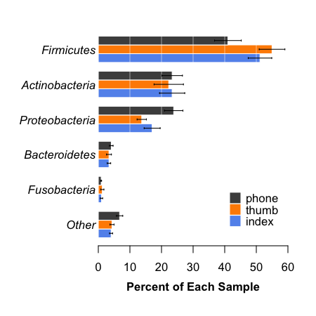
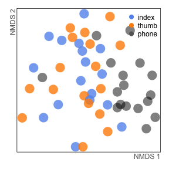

# Phone Microbiome/Biosensor Project

#### James Meadow (jfmeadow at gmail dot com)

-------------------------

_This analysis document accompanies a manuscript that reports analysis of microbial communities sampled from smartphone touchscreens, as well as the index fingers and thumbs of their owners. This was a project that was conducted as an educational workshop meant to explore innovative ways to monitor health. The manuscript is currently in review. This document was produced with the [`knitr` package](http://yihui.name/knitr/) in R, and all source code can be found on GitHub: [https://github.com/jfmeadow/Meadow_etal_Phones](https://github.com/jfmeadow/Meadow_etal_Phones)_

-------------------------

### Getting data into shape

The first step is to set a random seed (so results are locked in with those reported in the manuscript) and load some necessary R packages and functions. 


```r
set.seed(42)
options(scipen=7)
library(vegan)
```

```
Loading required package: permute
Loading required package: lattice
This is vegan 2.0-10
```

```r
library(labdsv)
```

```
Loading required package: mgcv
Loading required package: nlme
This is mgcv 1.7-28. For overview type 'help("mgcv-package")'.
Loading required package: MASS

Attaching package: 'labdsv'

The following object is masked from 'package:stats':

    density
```

```r
library(miscTools)
library(xtable)
library(boot)
```

```

Attaching package: 'boot'

The following object is masked from 'package:lattice':

    melanoma
```

```r

# These options just for debugging - knitr is automatically in dir. 
# setwd('~/Dropbox/rwjf/Meadow_etal_Phones/')  
# load('phones.RData')

source('functions.R')
```


The OTU table is brought in with a custom function `QiimeIn` that reads a classic OTU table and then splits it into a few useful pieces in a big list. The Bioconductor package `phyloseq` actually has more efficient ways to do this with the `.biom` format, but my modest function will work here - the outcome is practically the same in this case. 


```r
rw.list <- QiimeIn(file='phones_otu_table.txt')
# removed comment character from first line so R takes it. 
rw.map <- read.delim('phones_map.txt', head=TRUE, row.names=1)  
rw.big <- rw.list$Table
rw.taxo <- rw.list$Taxa
rm(rw.list)
```


Next, the OTU table needs to be put into shape. R wants to see letters, not numbers, as row names, so a big X is inserted. Remove this. 
We found a total of 3207836 sequences, consisting of 56 samples and 34400 OTUs, defined at 97% sequence similarity. 
Then line up with the order of the mapping file. 


```r
row.names(rw.big) <- gsub('X', '', row.names(rw.big))
rw.big <- rw.big[row.names(rw.map), ]
```


-----------

### Configure OTU table

Before anything else, we should remove any OTUs from lab controls that showed up in experiment samples. Cell phone surfaces hold really low biomass, so amplification contamination is inevitable. Best to just remove them all. Save the list of contaminant OTUs to shore up the taxonomy table below. 


```r
cont <- grep('cont', row.names(rw.map))
cont.table <- rw.big[cont, ]
cont.otus <- which(colSums(cont.table) >0)

rw.table.nocontrol <- rw.big[-cont, -cont.otus]
sort(rowSums(rw.table.nocontrol))
```

```
20.phone 22.phone 31.phone 29.phone 30.phone 35.index 26.thumb 35.phone 
    2719     4142     4612     5425     6356     6863     7952     8286 
20.thumb 20.index 28.index 19.phone 18.index 18.phone 25.phone 26.phone 
    9362    10023    10417    10834    10972    11022    11800    12105 
17.phone 34.phone 29.index 30.index 30.thumb 35.thumb 18.thumb 17.thumb 
   12348    12730    13474    13898    14052    14241    14286    14833 
34.thumb 29.thumb 34.index 28.phone 32.index 22.index 33.thumb 25.thumb 
   15015    15392    16022    16946    17051    17250    17290    17543 
33.phone 25.index 26.index 33.index 17.index 23.phone 19.index 32.thumb 
   18673    18991    19741    19751    20257    20379    20920    20949 
32.phone 31.index 23.thumb 22.thumb 19.thumb 23.index 31.thumb 24.phone 
   20976    21406    21747    25087    27009    27196    29835    30507 
28.thumb 24.thumb 24.index 
   31828    32916    34054 
```

```r
rm(rw.big, cont.table, cont)
```


Next:

* Plant sequences are always in 16S datasets, so one way to remove them is to call them by name "_Streptophyta_." These get removed.
* Do the same for mitochondrial sequences. 
* Remove lab contaminants identified above.  
* Remove OTUs that are represented by only 1 or 2 sequences - these lend little to community analysis and slow down the whole works. 
* The last step is to rarefy all samples to an even sampling depth, in this case 2500 sequences per sample.


```r
rw.taxo <- rw.taxo[-cont.otus, ]
streptophyta <- grep('Streptophyta', rw.taxo$taxa.names)
mitochondria <- grep('mitochondria', rw.taxo$taxa.names)
rw.table.tmp <- rw.table.nocontrol[, -c(streptophyta, mitochondria)]
sort(rowSums(rw.table.tmp))
```

```
20.phone 22.phone 31.phone 30.phone 29.phone 35.phone 30.thumb 20.thumb 
    2660     4005     4471     4731     5306     5633     5993     6268 
35.index 30.index 26.thumb 28.index 20.index 18.phone 17.phone 18.index 
    6572     6705     6719     6758     8873     9711    10212    10669 
19.phone 25.phone 26.phone 34.phone 29.index 18.thumb 35.thumb 17.thumb 
   10825    11591    12067    12651    13196    13832    14059    14765 
34.thumb 29.thumb 34.index 28.phone 22.index 32.index 33.thumb 25.thumb 
   14940    15242    15963    16790    16890    16977    17070    17434 
33.phone 26.index 25.index 33.index 17.index 23.phone 19.index 32.thumb 
   18562    18885    18898    19642    20076    20208    20845    20879 
32.phone 31.index 23.thumb 24.phone 28.thumb 22.thumb 19.thumb 23.index 
   20960    20977    21706    22336    24423    24887    26952    27103 
31.thumb 24.thumb 24.index 
   29752    32669    33865 
```

```r
rw.table.tmp <- rw.table.tmp[, -c(which(colSums(rw.table.tmp) < 3))]
```


```r
rw.25 <- rrarefy(rw.table.tmp, 2500)
rm(streptophyta, mitochondria, rw.table.tmp, cont.otus, rw.table.nocontrol)
```


Since lots of OTUs were removed from the OTU table, we remove them from the taxonomy table - we will want everything lined up downstream. 


```r
# taxonomy
rw.taxo.25 <- rw.taxo[colnames(rw.25), ]
rm(rw.taxo)
```


So we're left with 127500 sequences 
in 51 samples 
and 6667 OTUs. 

------------------

### Configure sample metadata


The mapping file (metadata for each sample) was loaded in during the first step. 
First, we line up samples with the OTU table row names since it is now in shape. Then there is lots of baggage that comes along with mapping files. Factor variables must be retrained, and then we add three colors that will be used in analysis. 


```r

# mapping file
map <- rw.map[row.names(rw.25), ]  # reorder to match 
rm(rw.map)  # remove old one

# then reorder a few factors for convenience. 
map$individ <- factor(map$individ, levels=c(as.character(levels(map$individ)[1:17])))
map$location <- factor(map$location, levels=c('index', 'thumb', 'phone'))
map$type <- factor(map$type, levels=c('c', 'o', 'p'))
map$dominance <- factor(map$dominance, levels=c('r', 'l'))
map$gender <- factor(map$gender, levels=c('f', 'm'))
map$wash <- factor(map$wash, levels=c('y', 'n'))
map <- map[, c(3, 5, 7, 8, 9)]

# create colors for plotting ease
map$bg <- 'gray30'  # phones
map$bg[map$location == 'index'] <- 'cornflowerblue'
map$bg[map$location == 'thumb'] <- 'darkorange'
```


And create a few more variables. 


```r
map$loc.gen <- paste(map$location, map$gender, sep='.')
map$location2 <- as.character(map$location)
map$location2[map$location2 != 'phone'] <- 'finger'
map$location2 <- factor(map$location2)
map$loc.gen2 <- factor(paste(map$location2, map$gender, sep='.'), 
                       levels=c('finger.f', 'phone.f', 'finger.m', 'phone.m'))

index <- which(map$location == 'index')
thumb <- which(map$location == 'thumb')
finger <- which(map$location2 == 'finger')

m <- which(map$gender == 'm')
f <- which(map$gender == 'f')
p <- which(map$location == 'phone')
```


### Generate taxonomy figure

Taxonomy information, as QIIME gives it, is pretty useless raw. So we have to parse this into a workable data frame, and then use that for figures. First, rename and save on typing! Then the separation between taxonomic levels is used to split strings. A couple more steps and then we have a data frame with 7 taxonomic levels and one last column for total abundance across the rarefied dataset. 


```r
tt <- rw.taxo.25
tt2 <- as.character(gsub('[[:alpha:]]{1,1}\\_\\_', '', tt$taxa.names))
tt3 <- strsplit(tt2, split='; ')
ttl <- unlist(lapply(tt3, length))

tt4 <- data.frame(
  kingdom=sapply(tt3, function(x){x[1]}),
  phylum=sapply(tt3, function(x){x[2]}),
  class=sapply(tt3, function(x){x[3]}),
  order=sapply(tt3, function(x){x[4]}),
  family=sapply(tt3, function(x){x[5]}),
  genus=sapply(tt3, function(x){x[6]}), 
  species=sapply(tt3, function(x){x[7]}))

tt4$kingdom <- as.character(tt4$kingdom)
tt4$phylum <- as.character(tt4$phylum)
tt4$class <- as.character(tt4$class)
tt4$order <- as.character(tt4$order)
tt4$family <- as.character(tt4$family)
tt4$genus <- as.character(tt4$genus)
tt4$species <- as.character(tt4$species)

for (i in 1:ncol(tt4)){
	tt4[which(is.na(tt4[, i])), i] <- '' 
	} # warning suppressed

taxo <- tt4
taxo$abundance <- colSums(rw.25)
row.names(taxo) <- rw.taxo.25$qiime.id
rm(tt, tt2, tt3, ttl, tt4)

head(taxo)
```

```
    kingdom         phylum               class             order
3  Bacteria Proteobacteria Gammaproteobacteria   Pseudomonadales
11 Bacteria Proteobacteria Gammaproteobacteria Enterobacteriales
16 Bacteria    Tenericutes          Mollicutes Acholeplasmatales
30 Bacteria Planctomycetes      Planctomycetia        Gemmatales
31 Bacteria     Firmicutes          Clostridia     Clostridiales
42 Bacteria    Chloroflexi               C0119                  
               family         genus    species abundance
3       Moraxellaceae Enhydrobacter aerosaccus         2
11 Enterobacteriaceae                                  0
16 Acholeplasmataceae  Acholeplasma                    0
30     Isosphaeraceae                                  3
31    Veillonellaceae     Dialister                  226
42                                                     3
```


Looks good. Then we want to know about the most abundant phyla, to be used for a taxonomy figure. 


```r
ph <- aggregate(taxo$abundance, by=list(taxo$phylum), FUN=sum)
ph[rev(order(ph$x))[1:10], ] #  cut off at unidentified.
```

```
          Group.1     x
15     Firmicutes 49690
21 Proteobacteria 28145
4  Actinobacteria 26953
6   Bacteroidetes 12869
16   Fusobacteria  4124
1                  3942
11  Cyanobacteria   384
25    Tenericutes   306
2        [Thermi]   247
3   Acidobacteria   207
```


We can use the top 5 and group all others. So a new data frame is created to hold the mean abundances grouped by phylum and by location type (index, thumb, or phone). This code is not pretty but it works.


```r
ph.mean <- data.frame(
  Firmicutes = aggregate(rowSums(rw.25[, which(taxo$phylum == 'Firmicutes')]), 
    by=list(map$location), FUN=mean),
	Proteobacteria = aggregate(rowSums(rw.25[, which(taxo$phylum == 'Proteobacteria')]), 
    by=list(map$location), FUN=mean),
	Actinobacteria = aggregate(rowSums(rw.25[, which(taxo$phylum == 'Actinobacteria')]), 
    by=list(map$location), FUN=mean),
  Bacteroidetes = aggregate(rowSums(rw.25[, which(taxo$phylum == 'Bacteroidetes')]), 
    by=list(map$location), FUN=mean),
	Fusobacteria = aggregate(rowSums(rw.25[, which(taxo$phylum == 'Fusobacteria')]), 
    by=list(map$location), FUN=mean),
	Other = aggregate(rowSums(rw.25[, -c(which(taxo$phylum %in% 
		c('Firmicutes', 'Proteobacteria', 'Actinobacteria', 
      'Fusobacteria', 'Bacteroidetes')))]), 
		by=list(map$location), FUN=mean))

ph.mean <- ph.mean[, c(2, 4, 6, 8, 10, 12)]
row.names(ph.mean) <- c('index', 'thumb', 'phone')
names(ph.mean) <- gsub('.x', '', names(ph.mean))
ph.mean <- ph.mean/2500
```


Then the same thing is done, but to generate standard errors for bar graph error bars. It is the same big ugly code chunk, but FUN=sd is used as the final arguement. SE must be calculated by hand in r, so there is one extra step, and then they are reversed so the big bars are on top in descending order.


```r
se <- function(x) {sd(x)/sqrt(length(x))}
rw.25.rel <- rw.25/2500

ph.se <- data.frame(
	Firmicutes = aggregate(rowSums(rw.25.rel[, which(taxo$phylum == 'Firmicutes')]), 
    by=list(map$location), FUN=se),
	Proteobacteria = aggregate(rowSums(rw.25.rel[, which(taxo$phylum == 'Proteobacteria')]), 
    by=list(map$location), FUN=se),
	Actinobacteria = aggregate(rowSums(rw.25.rel[, which(taxo$phylum == 'Actinobacteria')]), 
    by=list(map$location), FUN=se),
	Bacteroidetes = aggregate(rowSums(rw.25.rel[, which(taxo$phylum == 'Bacteroidetes')]), 
    by=list(map$location), FUN=se),
  Fusobacteria = aggregate(rowSums(rw.25.rel[, which(taxo$phylum == 'Fusobacteria')]), 
    by=list(map$location), FUN=se),
	Other = aggregate(rowSums(rw.25.rel[, -c(which(taxo$phylum %in% 
		c('Firmicutes', 'Proteobacteria', 'Actinobacteria', 
      'Fusobacteria', 'Bacteroidetes')))]), 
		by=list(map$location), FUN=se))
ph.se <- ph.se[, c(2, 4, 6, 8, 10, 12)]
row.names(ph.se) <- c('index', 'thumb', 'phone')
names(ph.se) <- gsub('.x', '', names(ph.se))
```


And then turn them upside down for nicer plotting. 


```r
ph.mean <- ph.mean[, c(6:1)]
ph.se <- ph.se[, c(6:1)]
```


Now we have data in place to make a barplot by hand: 


```r
# pdf('phylumBarplot.pdf', height=6, width=6, useDingbats=FALSE)
par(mar=c(5,7,2,2), las=1, font.lab=1)
mids <- barplot(as.matrix(ph.mean), beside=TRUE, horiz=TRUE, las=1, xlim=c(0,.6), 
  border='white', xlab='', axisnames=FALSE, 
  col=c('cornflowerblue', 'darkorange', 'gray30'), xaxt='n', font.lab=2)
abline(v=c(seq(.1, .6, .1)), col='white', lwd=.5)
arrows(unlist(c(ph.mean-ph.se)), unlist(c(mids)), 
	   unlist(c(ph.mean+ph.se)), unlist(c(mids)),
	code=3, angle=90, length=.01)
axis(1, at=c(0,.1,.2,.3,.4,.5,.6), labels=c(0,10,20,30,40,50,60))
legend(.40, 7, legend=c('phone', 'thumb', 'index'), pch=15, pt.cex=2, 
	col=c('gray30', 'darkorange', 'cornflowerblue'), bty='n', y.intersp=.82)
mtext('Percent of Each Sample', side=1, line=2.4, font=2)
mtext(names(ph.mean), side=2, at=c(mids[2, ]), line=.2, font=3)
```

 

```r
# dev.off()
```


Now try to hone in on the Firmicutes since that is the most prominent difference: 

_Note - One OTU (Paenibacillus) appears to be an outlier with a wacky distribution, so it is left out. Although `set.seed` is used at the top, it might show up in the top 10 again if it is all run again._ 


```r
#Firmicutes = aggregate(rowSums(rw.25.rel[, which(taxo$phylum == 'Firmicutes')]), 
#    by=list(map$location), FUN=se),
fir.table <- rw.25.rel[, which(taxo$phylum == 'Firmicutes')]
fir.taxo <- taxo[taxo$phylum == 'Firmicutes', ]
identical(colnames(fir.table), row.names(fir.taxo))
```

```
[1] TRUE
```

```r

# leave out outlier
fir.table.10 <- fir.table[, names(rev(sort(colSums(fir.table)))[c(1:3, 5:11)])]  
fir.taxo.10 <- fir.taxo[colnames(fir.table.10), ]
dim(fir.table.10)
```

```
[1] 51 10
```

```r
sum(colMeans(fir.table.10))
```

```
[1] 0.1557
```


What percentage of observations are represented here? 15.5749%


Look at each of the top 10 to see if there is more to investigate.

_Note - This is not evaluated for the `knitr` document. Only during data exploration._ 


```r
for(i in 1:ncol(fir.table.10)) {
  boxplot(fir.table.10[, i] ~ map$loc.gen2)
  mtext(fir.taxo.10$genus[i])
  readline('press enter')
  }
```


Yes. Very much so. There are some really interesting gender differences in the most abundant taxa. This will make a nice addition to the barplot. 

_Note, again, that one of the original top 10 shows an ugly distribution = all driven by one person with A LOT of Paenibacillus on his fingers. So that one was removed in the code above for clarity - now we're looking at `c(1:4, 6:11)` to make an even 10. For further investigation, that OTU was ID\# 29684. Oddly, it was elevated on both fingers, but didn't show up on his phone. It was nearly absent from all other samples._ 

Now create data frames to hold plotting info.


```r
fir.mean <- data.frame(matrix(NA, 4, 10))
row.names(fir.mean) <- levels(map$loc.gen2)
names(fir.mean) <- colnames(fir.table.10)

fir.se <- data.frame(matrix(NA, 4, 10))
row.names(fir.se) <- levels(map$loc.gen2)
names(fir.se) <- colnames(fir.table.10)

test <- aggregate(fir.table.10[, i], by=list(map$loc.gen2), mean)

if(identical(row.names(fir.mean), as.character(test$Group.1))) {
  for (i in 1:10) {
    fir.mean[, i] <- aggregate(fir.table.10[, i], by=list(map$loc.gen2), mean)$x
    fir.se[, i] <- aggregate(fir.table.10[, i], by=list(map$loc.gen2), se)$x
    }
} else {print("Didn't work - rows weren't lined up!")}

fir.mean <- fir.mean[4:1, 10:1] * 100
fir.se <- fir.se[4:1, 10:1] * 100
```


And do the same for Proteobacteria.


```r
pro.table <- rw.25.rel[, which(taxo$phylum == 'Proteobacteria')]
pro.taxo <- taxo[taxo$phylum == 'Proteobacteria', ]
identical(colnames(pro.table), row.names(pro.taxo))
```

```
[1] TRUE
```

```r

pro.table.10 <- pro.table[, names(rev(sort(colSums(pro.table)))[c(1:10)])]
pro.taxo.10 <- fir.taxo[colnames(pro.table.10), ]
dim(pro.table.10)
```

```
[1] 51 10
```

```r
sum(colMeans(pro.table.10))
```

```
[1] 0.102
```


What percentage of observations are represented here? 10.2016%


```r
pro.mean <- data.frame(matrix(NA, 4, 10))
row.names(pro.mean) <- levels(map$loc.gen2)
names(pro.mean) <- colnames(pro.table.10)

pro.se <- data.frame(matrix(NA, 4, 10))
row.names(pro.se) <- levels(map$loc.gen2)
names(pro.se) <- colnames(pro.table.10)

test <- aggregate(pro.table.10[, i], by=list(map$loc.gen2), mean)

if(identical(row.names(pro.mean), as.character(test$Group.1))) {
  for (i in 1:10) {
    pro.mean[, i] <- aggregate(pro.table.10[, i], by=list(map$loc.gen2), mean)$x
    pro.se[, i] <- aggregate(pro.table.10[, i], by=list(map$loc.gen2), se)$x
    }
} else {print("Didn't work - rows weren't lined up!")}

pro.mean <- pro.mean[4:1, 10:1] * 100
pro.se <- pro.se[4:1, 10:1] * 100
```


So now try to combine them. One error bar spills of the right margin, but it is not worth throwing off the whole balance of the figure. So instead I wrote a simple break at the margin to report the real value. _Might move around if re-rarefied without setting seed. So it goes._ 


```r
# pdf('phylumFermiProteoBarplot.pdf', height=6, width=12, useDingbats=FALSE)
# par(mfrow=c(1,2))
layout(matrix(c(1,2,3), 1,3), widths=c(1.25, 1, 1))
par(mar=c(5,9,2,2), las=1, font.lab=1, 
    fg='gray20', col.axis='gray20', col.lab='gray20')
mids <- barplot(as.matrix(ph.mean), beside=TRUE, horiz=TRUE, las=1, xlim=c(0,.6), 
  border='white', xlab='', axisnames=FALSE, 
  col=c('cornflowerblue', 'darkorange', 'gray30'), xaxt='n', font.lab=2)
abline(v=c(seq(.1, .6, .1)), col='white', lwd=.5)
arrows(unlist(c(ph.mean-ph.se)), unlist(c(mids)), 
     unlist(c(ph.mean+ph.se)), unlist(c(mids)),
	code=3, angle=90, length=.01)
axis(1, at=c(0,.1,.2,.3,.4,.5,.6), labels=c(0,10,20,30,40,50,60))
legend(.40, 4, legend=c('phone', 'thumb', 'index'), pch=15, pt.cex=3, cex=1.4, 
	col=c('gray30', 'darkorange', 'cornflowerblue'), bty='n', y.intersp=.9)
mtext('Percent of Each Sample', side=1, line=2.4, font=2)
mtext('(a) Most abundant phyla', side=3, line=0, font=2, at=0, adj=0)
mtext(names(ph.mean), side=2, at=c(mids[2, ]), line=.2, font=1)
par(xpd=TRUE)
segments(0, c(mids[1, ]-.45), 0, c(mids[3, ]+.45))
par(xpd=FALSE)

# Firmicutes
par(mar=c(5,8,2,2), las=1, font.lab=1, xpd=FALSE, 
    fg='gray20', col.axis='gray20', col.lab='gray20')
mids <- barplot(as.matrix(fir.mean), beside=TRUE, horiz=TRUE, las=1, xlim=c(0,8), 
  border='white', axisnames=FALSE, 
  col=c('gray30', 'cornflowerblue'), font.lab=2)
abline(v=c(seq(1, 8, 1)), col='white', lwd=.5)
arrows(unlist(c(fir.mean-fir.se)), unlist(c(mids)), 
     unlist(c(fir.mean+fir.se)), unlist(c(mids)),
  code=3, angle=90, length=.01)
mtext('Percent of Each Sample', side=1, line=2.4, font=2)
mtext('(b) Firmicutes', side=3, line=0, font=2, at=0, adj=0)

par(xpd=TRUE)
segments(0, c(mids[1, ]-.45), 0, c(mids[4, ]+.45))
for (i in 1:10) {
  segments(-.05, mean(mids[, i]), -.5, mean(mids[, i]), col='gray60')
text(-.25, mean(mids[1:2, i]), 
     "\\MA",vfont=c("sans serif symbol","plain"), font=2, col='gray20', cex=1.5)
text(-.25, mean(mids[3:4, i]), 
     "\\VE",vfont=c("sans serif symbol","plain"), font=2, col='gray20', cex=1.5)
barname <- taxo[names(fir.mean)[i], 'genus']
font <- 3
if (barname == '') {
  barname <- taxo[names(fir.mean)[i], 'family']
  font <- 1}
mtext(barname, side=2, at=mean(mids[, i]), line=1.5, font=font)
}

# Proteobacteria
par(mar=c(5,8,2,2.5), las=1, font.lab=1, xpd=FALSE, 
    fg='gray20', col.axis='gray20', col.lab='gray20')
mids <- barplot(as.matrix(pro.mean), beside=TRUE, horiz=TRUE, las=1, xlim=c(0,8), 
  border='white', axisnames=FALSE, 
  col=c('gray30', 'cornflowerblue'), font.lab=2)
abline(v=c(seq(1, 8, 1)), col='white', lwd=.5)
arrows(unlist(c(pro.mean-pro.se)), unlist(c(mids)), 
     unlist(c(pro.mean+pro.se)), unlist(c(mids)),
  code=3, angle=90, length=.01)
mtext('Percent of Each Sample', side=1, line=2.4, font=2)
mtext('(c) Proteobacteria', side=3, line=0, font=2, at=0, adj=0)

par(xpd=TRUE)
segments(0, c(mids[1, ]-.45), 0, c(mids[4, ]+.45))
for (i in 1:10) {
  segments(-.05, mean(mids[, i]), -.5, mean(mids[, i]), col='gray60')
text(-.25, mean(mids[1:2, i]), 
     "\\MA",vfont=c("sans serif symbol","plain"), font=2, col='gray20', cex=1.5)
text(-.25, mean(mids[3:4, i]), 
     "\\VE",vfont=c("sans serif symbol","plain"), font=2, col='gray20', cex=1.5)
barname <- taxo[names(pro.mean)[i], 'genus']
font <- 3
if (barname == '') {
  barname <- taxo[names(pro.mean)[i], 'family']
  font <- 1 }
mtext(barname, side=2, at=mean(mids[, i]), line=1.5, font=font)
if (barname == 'Photobacterium') {fixit <- i}
}

# Fix Photobacterium error bar break
fixx <- 8
fixy <- mids[1, fixit]
realSE <- round(pro.mean[1, fixit] + pro.se[1, fixit], 1)
par(xpd=TRUE)
segments(fixx-.1, fixy-.5, fixx+.1, fixy+.5)
segments(fixx+.1, fixy-.5, fixx+.3, fixy+.5)
text(fixx+.1, fixy, realSE, pos=4, cex=.7)
```

 

```r

# dev.off()
```


----------------------

### Canberra Distance Barplots - how are phones related to people?

Next, we want to know how communities break out between people and their phones. To do this, we make a distance matrix. In our case, we want to be able to easily explain so we use Jaccard similarity $$ S_{jaccard} = \frac{shared~richness}{combined~richness} $$ so that we can interpret in easy language. Later, we'll also want a _similarity_ rather than a _distance_, so we'll invert the distance R gives by default $$ S_{jaccard} = 1-D_{jaccard} $$. This way things with more in common have higher values, and that is easier to visualize.

Note that this was tried also with the same Canberra distance that will be used later for ordinations. Results were almost identical, but Jaccard is much easier to interpret for this sort of graph, so we use Jaccard. 


```r
dis <- vegdist(rw.25, 'jaccard')
```


Since we want to do this several times, I'll package a few tedious routines into functions to cut down on repetative coding. First set up a data frame for the whole dataset. 


```r
bar.df <- data.frame(matrix(0,17,3))
names(bar.df) <- c('in.th', 'in.ph', 'th.ph')
row.names(bar.df) <- unique(map$individ)
```


Then create the functions that will be used a few times.


```r
makeBarDF <- function() {
  for(i in 1:nrow(bar.df)) {
  bar.df[i, 1] <- as.matrix(dis)[which(map$individ == row.names(bar.df)[i] &
								   		 map$location == 'index'), 
								   which(map$individ == row.names(bar.df)[i] & 
								   		 map$location == 'thumb')]
	bar.df[i, 2] <- as.matrix(dis)[which(map$individ == row.names(bar.df)[i] &
								   		 map$location == 'index'), 
								   which(map$individ == row.names(bar.df)[i] & 
								   		 map$location == 'phone')]
	bar.df[i, 3] <- as.matrix(dis)[which(map$individ == row.names(bar.df)[i] &
								   		 map$location == 'thumb'), 
								   which(map$individ == row.names(bar.df)[i] & 
								   		 map$location == 'phone')]
  }
  invisible(bar.df)
}

makeBarSummary <- function(bar.df=bar.df) {
  bar.summary <- data.frame(cbind(apply(bar.df, 2, mean), 
					 	       (apply(bar.df, 2, sd)/sqrt(nrow(bar.df)))))
  bar.summary[, 3] <- bar.summary[, 1]-bar.summary[, 2]
  bar.summary[, 4] <- bar.summary[, 1]+bar.summary[, 2]
  names(bar.summary) <- c('mean', 'se', 'se.lo', 'se.hi')
  invisible(bar.summary)
}
```


And then run the data set through the functions. 


```r
bar.jac.df <- makeBarDF()
bar.jac <- makeBarSummary(bar.df=bar.jac.df)

bar.jac.df
```

```
    in.th  in.ph  th.ph
17 0.5714 0.7820 0.7961
18 0.5541 0.8652 0.8010
19 0.6559 0.7030 0.7016
20 0.6226 0.7361 0.8058
22 0.6230 0.8146 0.8015
23 0.5657 0.6880 0.7537
24 0.5057 0.7992 0.7888
25 0.6339 0.7712 0.7596
26 0.7345 0.7843 0.8180
28 0.7975 0.8312 0.9639
29 0.5661 0.7434 0.7335
30 0.5225 0.8690 0.8777
31 0.8115 0.8356 0.8834
32 0.7026 0.6638 0.5900
33 0.6053 0.7137 0.6667
34 0.6180 0.8075 0.7802
35 0.9066 0.8729 0.9291
```

```r
bar.jac
```

```
        mean      se  se.lo  se.hi
in.th 0.6469 0.02677 0.6201 0.6736
in.ph 0.7812 0.01575 0.7655 0.7970
th.ph 0.7912 0.02235 0.7689 0.8136
```


Each additional time, we're only interested in a few samples at a time, so run subsets through the same functions. Each starts out being named generically `bar.df`, but then each object gets put into a uniquely named data frame.

First we need to know how many are in each group.


```r
table(map$gender)/3
```

```

 f  m 
10  7 
```

```r
table(map$wash)/3
```

```

y n 
9 8 
```

```r

# females=10 
bar.df <- data.frame(matrix(0,10,3))
names(bar.df) <- c('in.th', 'in.ph', 'th.ph')
row.names(bar.df) <- unique(map$individ[which(map$gender == 'f')])
bar.df.female.j <- makeBarDF()
bar.female.j <- makeBarSummary(bar.df=bar.df.female.j)

# males=7
bar.df <- data.frame(matrix(0,7,3))
names(bar.df) <- c('in.th', 'in.ph', 'th.ph')
row.names(bar.df) <- unique(map$individ[which(map$gender == 'm')])
bar.df.male.j <- makeBarDF()
bar.male.j <- makeBarSummary(bar.df=bar.df.male.j)

# yes wash=9 
bar.df <- data.frame(matrix(0,9,3))
names(bar.df) <- c('in.th', 'in.ph', 'th.ph')
row.names(bar.df) <- unique(map$individ[which(map$wash == 'y')])
bar.df.wash.j <- makeBarDF()
bar.wash.j <- makeBarSummary(bar.df=bar.df.wash.j)

# no wash=8
bar.df <- data.frame(matrix(0,8,3))
names(bar.df) <- c('in.th', 'in.ph', 'th.ph')
row.names(bar.df) <- unique(map$individ[which(map$wash == 'n')])
bar.df.nowash.j <- makeBarDF()
bar.nowash.j <- makeBarSummary(bar.df=bar.df.nowash.j)
```


To make it easeier to combine side by side barplots, we'll combine them into joined data frames based on their variables (males and females, and wash and no-wash). Then one last step to invert the numbers from a distance to a similarity. 


```r
bar.mf <- data.frame(rbind(bar.male.j[1, ], bar.female.j[1, ],
  					   bar.male.j[2, ], bar.female.j[2, ],
						   bar.male.j[3, ], bar.female.j[3, ]))
bar.wnw <- data.frame(rbind(bar.wash.j[1, ], bar.nowash.j[1, ],
						   bar.wash.j[2, ], bar.nowash.j[2, ],
						   bar.wash.j[3, ], bar.nowash.j[3, ]))

bar.jac <- 1-bar.jac
bar.mf <- 1-bar.mf
bar.wnw <- 1-bar.wnw
```


All data are in place, so there is lots of futzy code to get barplots to look nice. These were modeled after Edward Tufte's _The Visual Display of Quantitative Information_.


```r
# pdf('longBarplotFigure.pdf', width=8, height=4)
ylim <- c(0,.5)
layout(matrix(c(1,2,3), 1,3), widths=c(1, 1.6, 1.6))
par(mar=c(4, 4.5, 2, 1), las=1, fg='gray20', lheight=1, col.axis='gray20', col.lab='gray20')
mids <- barplot(bar.jac$mean, las=1, 
  border='transparent', axes=FALSE, ylim=ylim, yaxs='i', 
	# ylab='Percent of species in common')
  ylab='')
mtext('Jaccard Similarity\n(as % of shared OTUs)', side=2, line=2, las=0, cex=.8)
abline(h=c(.1,.2,.3,.4,.5), col='white', lwd=1)
mtext(c('index\n&\nthumb', 'index\n&\nphone', 'thumb\n&\nphone'), 
	side=1, line=2.1, at=c(mids), cex=.7, col='gray20')
axis(2, col='gray20', col.ticks='gray20', 
	at=c(0,.1,.2,.3,.4,.5), labels=c(0,10,20,30,40,'50%'))
arrows(mids, bar.jac$se.lo, mids, bar.jac$se.hi, code=3, 
	angle=90, length=.05, col='gray40')
mtext('(a) All samples', font=2, col='gray20', line=.5)
#
par(mar=c(4, 2, 2, 1))
mids <- barplot(bar.mf$mean, las=1, col=c('gray80', 'gray50'),
	border='transparent', axes=FALSE, ylim=ylim, yaxs='i')
abline(h=c(.1,.2,.3,.4,.5), col='white', lwd=1)
mtext(c('index\n&\nthumb', 'index\n&\nphone', 'thumb\n&\nphone'), 
	side=1, line=2.1, cex=.7, col='gray20',
	at=c(mean(mids[1:2,1]), mean(mids[3:4,1]), mean(mids[5:6,1])))
arrows(mids, bar.mf$se.lo, mids, bar.mf$se.hi, code=3, 
	angle=90, length=.05, col='gray20')
mtext('(b) Male or Female?', font=2, col='gray20', line=.5)
legend(5, .5, legend=c('m', 'f'), pch=15, col=c('gray80', 'gray50'), 
	pt.cex=2, bty='n')
par(xpd=TRUE)
segments(c(mids[c(1,3,5), 1])-.48, rep(-.00, 3), 
	     c(mids[c(2,4,6), 1])+.48, rep(-.00, 3), 
	     col='gray30')  
par(xpd=FALSE)
#
par(mar=c(4, 2, 2, 1))
mids <- barplot(bar.wnw$mean, las=1, col=c('gray80', 'gray50'),
	border='transparent', axes=FALSE, ylim=ylim, yaxs='i')
abline(h=c(.1,.2,.3,.4,.5), col='white', lwd=1)
mtext(c('index\n&\nthumb', 'index\n&\nphone', 'thumb\n&\nphone'), 
	side=1, line=2.1, cex=.7, col='gray20',
	at=c(mean(mids[1:2,1]), mean(mids[3:4,1]), mean(mids[5:6,1])))
arrows(mids, bar.wnw$se.lo, mids, bar.wnw$se.hi, code=3, 
	angle=90, length=.05, col='gray20')
mtext('(c) Did you wash your hands?', font=2, col='gray20', line=.5)
legend(5, .5, legend=c('yes', 'no'), pch=15, col=c('gray80', 'gray50'), 
	pt.cex=2, bty='n')
par(xpd=TRUE)
segments(c(mids[c(1,3,5), 1])-.48, rep(-.00, 3), 
	     c(mids[c(2,4,6), 1])+.48, rep(-.00, 3), 
	     col='gray30')  
```

 

```r
par(xpd=FALSE)
# dev.off()
```


Isn't that nice? So this figure tells us a couple of really interesting things about the world that we didn't know before! For instance, about 35% of the bacterial taxa we find on our own index finger are also found on the opposing thumb. And (even though fewer) about 20% are also found on our phones! That general pattern is repeated regardless of whether we are looking at men or women, but interestingly, women seem to have more taxa in common with their phones. And your two fingers have more in common if you did not wash your hands. 

We can use simple paired t-tests to check some of the patterns in the plots. For instance: Is the first difference significant (are fingers closer to one another than either finger compared to phones)? First, we again need to invert distances to similarities for easier interpretation (already did this in summary tables, but now for raw distance data frames).


```r
bar.jac.df <- 1-bar.jac.df
bar.df.male.j <- 1-bar.df.male.j
bar.df.female.j <- 1-bar.df.female.j
bar.df.wash.j <- 1-bar.df.wash.j
bar.df.nowash.j <- 1-bar.df.nowash.j
```


```r
t.test(bar.jac.df$in.th, bar.jac.df$in.ph, paired=TRUE)
```

```

	Paired t-test

data:  bar.jac.df$in.th and bar.jac.df$in.ph
t = 4.81, df = 16, p-value = 0.0001923
alternative hypothesis: true difference in means is not equal to 0
95 percent confidence interval:
 0.07514 0.19355
sample estimates:
mean of the differences 
                 0.1343 
```

```r
t.test(bar.jac.df$in.th, bar.jac.df$th.ph, paired=TRUE)
```

```

	Paired t-test

data:  bar.jac.df$in.th and bar.jac.df$th.ph
t = 5.412, df = 16, p-value = 0.00005753
alternative hypothesis: true difference in means is not equal to 0
95 percent confidence interval:
 0.0878 0.2009
sample estimates:
mean of the differences 
                 0.1443 
```


Yes. Very much so. It looks like our fingers have about 35% of their taxa in common, while fingers and phones only share about 20% of taxa. 

And how about males and females differentially related to their phones?


```r
t.test(bar.df.male.j$in.ph, bar.df.female.j$in.ph)
```

```

	Welch Two Sample t-test

data:  bar.df.male.j$in.ph and bar.df.female.j$in.ph
t = -1.225, df = 13.34, p-value = 0.2418
alternative hypothesis: true difference in means is not equal to 0
95 percent confidence interval:
 -0.10595  0.02915
sample estimates:
mean of x mean of y 
   0.1962    0.2346 
```

```r
t.test(bar.df.male.j$th.ph, bar.df.female.j$th.ph)
```

```

	Welch Two Sample t-test

data:  bar.df.male.j$th.ph and bar.df.female.j$th.ph
t = -1.07, df = 14.38, p-value = 0.3022
alternative hypothesis: true difference in means is not equal to 0
95 percent confidence interval:
 -0.1408  0.0469
sample estimates:
mean of x mean of y 
   0.1812    0.2281 
```


Not so much. And are our fingers more similar if we don't wash our hands?


```r
t.test(bar.df.wash.j$in.th, bar.df.nowash.j$in.th)
```

```

	Welch Two Sample t-test

data:  bar.df.wash.j$in.th and bar.df.nowash.j$in.th
t = -2.238, df = 11.06, p-value = 0.04678
alternative hypothesis: true difference in means is not equal to 0
95 percent confidence interval:
 -0.205888 -0.001764
sample estimates:
mean of x mean of y 
   0.3043    0.4081 
```

```r
t.test(bar.df.wash.j$in.ph, bar.df.nowash.j$in.ph)
```

```

	Welch Two Sample t-test

data:  bar.df.wash.j$in.ph and bar.df.nowash.j$in.ph
t = -0.5067, df = 14.48, p-value = 0.62
alternative hypothesis: true difference in means is not equal to 0
95 percent confidence interval:
 -0.08386  0.05172
sample estimates:
mean of x mean of y 
   0.2112    0.2273 
```


The first (two fingers) is suggestive, but not totally convincing - there might be a difference of about 10% of OTUs. The second (relationship to phones) is not different at all. 

One last barplot to show whether or not our phones are more indicative of our own microbiome. The workflow will be pretty much the same, but we are picking out: 

* the similarities of each person's index finger compared to their own phone, and 
* each person's finger compared to the average distance to everyone else's phone


```r
dismat <- as.matrix(dis)
dismat <- 1-dismat

bar.df2 <- data.frame(matrix(0,17,2))
names(bar.df2) <- c('same.in.ph', 'others.in.ph')
row.names(bar.df2) <- unique(map$individ)

for(i in 1:nrow(bar.df2)) {
	bar.df2[i, 1] <- dismat[which(map$individ == row.names(bar.df2)[i] &
								   		 map$location == 'index'), 
								   which(map$individ == row.names(bar.df2)[i] & 
								   		 map$location == 'phone')]
	bar.df2[i, 2] <- mean(dismat[which(map$individ == row.names(bar.df2)[i] &
								   		 map$location == 'index'), 
								   which(map$individ != row.names(bar.df2)[i] & 
								   		 map$location == 'phone')])
  }
  
bar.summary2 <- data.frame(
				cbind(apply(bar.df2, 2, mean), 
					 (apply(bar.df2, 2, sd)/sqrt(nrow(bar.df2)))))
  
bar.summary2[, 3] <- bar.summary2[, 1]-bar.summary2[, 2]
bar.summary2[, 4] <- bar.summary2[, 1]+bar.summary2[, 2]
names(bar.summary2) <- c('mean', 'se', 'se.lo', 'se.hi')
bar.others <- bar.summary2
bar.others.df <- bar.df2
```


And make the plot. 


```r
# pdf('resemblePhone.pdf', width=2.5, height=3)
par(mar=c(3, 4.5, 2, 1), las=1, col.axis='gray20', col.lab='gray20', fg='gray20')
mids <- barplot(bar.others$mean, las=1, 
	border='transparent', axes=FALSE, ylim=c(0,.3), yaxs='i', 
	# ylab='Percent of species in common')
  ylab='')
mtext('Jaccard Similarity\n(as % of shared OTUs)', side=2, line=2.2, las=0)
abline(h=seq(0, .3, .05), col='white', lwd=1)
mtext(c('index &\nown\nphone', 'index &\nother\nphones'), 
	side=1, line=1.6, at=c(mids), cex=.8, col='gray20')
axis(2, col='gray20', col.ticks='gray20', 
	at=c(0,.1,.2,.3), labels=c(0,10,20,'30%'))
arrows(mids, bar.others$se.lo, mids, bar.others$se.hi, code=3, 
	angle=90, length=.05, col='gray40')
mtext('Does your phone\nresemble you?', font=2, col='gray20')
```

 

```r
# dev.off()
```


And is that significant?


```r
apply(bar.others.df, 2, mean)
```

```
  same.in.ph others.in.ph 
      0.2188       0.1169 
```

```r
t.test(bar.others.df$same.in.ph, bar.others.df$others.in.ph, paired=TRUE)
```

```

	Paired t-test

data:  bar.others.df$same.in.ph and bar.others.df$others.in.ph
t = 7.081, df = 16, p-value = 0.000002601
alternative hypothesis: true difference in means is not equal to 0
95 percent confidence interval:
 0.07137 0.13237
sample estimates:
mean of the differences 
                 0.1019 
```


So yes, your phone might be able to identify you. Or in other words, we see some evidence that the microbial assemblages on our phones are perhaps extensions of our own, and that they are to some degree personalized to us!

-------------------

### Community differences - Ordination and Discriminant Analysis

Do the fingers of men and women harbor different types of bacteria? Previous research says yes. In the current study, some people washed hands and some didn't. So we should find out if we have a balanced study (i.e., relatively even numbers in all four categories?). The answer is, of course, somewhat funny, though not _significantly_ funny. 


```r
gender.wash <- table(map$gender, map$wash)
cst <- chisq.test(gender.wash)
cst
```

```

	Pearson's Chi-squared test with Yates' continuity correction

data:  gender.wash
X-squared = 0.8503, df = 1, p-value = 0.3565
```

```r
cst$observed
```

```
   
     y  n
  f 18 12
  m  9 12
```

```r
cst$expected
```

```
   
        y      n
  f 15.88 14.118
  m 11.12  9.882
```

```r
rm(cst, gender.wash)
```


Anyway, the sample is reasonably well balanced. PERMANOVA tests like `adonis` are not necessarily robust to big inbalances, but probably not a problem for us. 

We'll use the Canberra distance, since we expect most of the abundant taxa to overlap - we are interested in differences among the relatively rare OTUs. Compared to the easily interpretable Jaccard index used above, these sophisticated dissimilarities tend to be more mathematically satisfying for ordination. If we look at an NMDS of all samples, it looks like there is a separation between fingers and phones, but not between finger types. Not too surprising given what we saw in the bar plots above. Notice that the ordination gets put into a generic object `n` to save on typing but also to make it easier to switch distance matrices or nmds objects later. 


```r
rw.25.can <- vegdist(rw.25, 'canberra')
```


```r
rw.25.nmds.can <- bestnmds(rw.25.can, k=2)
```


If we emphasize gender, it seems that men and women fall in different parts of the plot, and their communities, when considering all samples, are very significantly different. 


```r
rw.25.nmds.can$stress
```

```
[1] 21.58
```

```r
n <- rw.25.nmds.can

par(mfrow=c(1,1))
par(mar=c(2,2,1,1), las=0)
plot(n$points, pch=16, cex=3, ann=FALSE, xaxt='n', yaxt='n',
  col=ifelse(map$location == 'phone', rgb(0,0,0, .5),
    ifelse(map$location == 'index', 
			rgb(100/255, 149/255, 237/255, .8), # cornflowerblue
			rgb(255/255, 140/255, 0/255, .8)))) # darkorange
mtext('NMDS 1', side=1, line=.0, col='gray40', adj=1)
mtext('NMDS 2', side=2, line=.0, col='gray40', adj=1)
legend('topright', legend=c('index', 'thumb', 'phone'), 
	pch=16, col=c('cornflowerblue', 'darkorange', 'gray40'), 
	bty='n', pt.cex=1.5)
```

 


Earlier, we created sets of variables that combine sample location with gender - this now allows the use of ellipses to visualize confidence intervals in the ordination. 


It would be ideal if we could get most information only from sampling a single finger in future cell phone monitoring studies, instead of looking at both index fingers and thumbs. This ordination displays both fingers and phones. 


```r
# pdf('ordinationGenderBothFingers.pdf', height=4, width=8)
par(mfrow=c(1,2))
par(mar=c(2,2,2,1), las=0)
plot(n$points, type='n', ann=FALSE, xaxt='n', yaxt='n')
mtext('NMDS 1', side=1, line=.3, col='gray40', adj=1)
mtext('NMDS 2', side=2, line=.0, col='gray40', adj=1)
points(n$points[intersect(m,finger), ], pch=21, cex=2, col='gray', bg='white')
points(n$points[intersect(m,p), ], pch=21, cex=2, col='gray', bg='white')
ordiellipse(n, groups=map$loc.gen, show.groups='phone.f', 
            draw='polygon', col='gray80')
ordiellipse(n, groups=map$loc.gen, show.groups='phone.f', 
            draw='lines', lwd=1.2, col='gray80')
ordiellipse(n, groups=map$loc.gen2, show.groups='finger.f', 
            draw='polygon', col='cornflowerblue')
ordiellipse(n, groups=map$loc.gen2, show.groups='finger.f', 
            draw='lines', lwd=1.2, col='gray80')
points(n$points[intersect(f,finger), ], pch=21, cex=2.5, col='gray30',
      bg=rgb(100/255, 149/255, 237/255, .8)) # cornflowerblue       
points(n$points[intersect(f,p), ], pch=21, cex=2.5, col='gray30', 
      bg=rgb(0,0,0, .5)) 
mtext('(a) Females', line=.2, font=2, cex=1.5, adj=0)

par(mar=c(2,1,2,2), las=0)
plot(n$points, type='n', ann=FALSE, xaxt='n', yaxt='n')
mtext('NMDS 1', side=1, line=.3, col='gray40', adj=1)
#mtext('NMDS 2', side=2, line=.0, col='gray40', adj=1)
points(n$points[intersect(f,finger), ], pch=21, cex=2, col='gray', bg='white')
points(n$points[intersect(f,p), ], pch=21, cex=2, col='gray', bg='white')
ordiellipse(n, groups=map$loc.gen, show.groups='phone.m', 
            draw='polygon', col='gray80')
ordiellipse(n, groups=map$loc.gen, show.groups='phone.m', 
            draw='lines', lwd=1.2, col='gray80')
ordiellipse(n, groups=map$loc.gen2, show.groups='finger.m', 
            draw='polygon', col='cornflowerblue')
ordiellipse(n, groups=map$loc.gen2, show.groups='finger.m', 
            draw='lines', lwd=1.2, col='gray80')
points(n$points[intersect(m,finger), ], pch=21, cex=2.5, col='gray30',
      bg=rgb(100/255, 149/255, 237/255, .8)) # cornflowerblue       
points(n$points[intersect(m,p), ], pch=21, cex=2.5, col='gray30', 
      bg=rgb(0,0,0, .5)) 
# text(5,5,'Males', font=2, cex=2, col='gray40')
legend('bottomright', legend=c('phone', 'finger'), pch=21, bty='n', y.intersp=.9,
       pt.bg=c('gray40', 'cornflowerblue'), col='gray30', cex=1, pt.cex=1.5)
mtext('(b) Males', line=.2, font=2, cex=1.5, adj=0)
```

 

```r
# dev.off()
```


This version uses only index fingers compared to phones. 


```r
# pdf('ordinationGenderIndex.pdf', height=4, width=8)

par(mfrow=c(1,2))
par(mar=c(2,2,2,1), las=0)
plot(n$points, type='n', ann=FALSE, xaxt='n', yaxt='n')
mtext('NMDS 1', side=1, line=.3, col='gray40', adj=1)
mtext('NMDS 2', side=2, line=.0, col='gray40', adj=1)
points(n$points[intersect(m,index), ], pch=21, cex=2, col='gray', bg='white')
points(n$points[intersect(m,p), ], pch=21, cex=2, col='gray', bg='white')
ordiellipse(n, groups=map$loc.gen, show.groups='phone.f', 
            draw='polygon', col='gray80')
ordiellipse(n, groups=map$loc.gen, show.groups='phone.f', 
            draw='lines', lwd=1.2, col='gray80')
ordiellipse(n, groups=map$loc.gen, show.groups='index.f', 
            draw='polygon', col='cornflowerblue')
ordiellipse(n, groups=map$loc.gen, show.groups='index.f', 
            draw='lines', lwd=1.2, col='gray80')
points(n$points[intersect(f,index), ], pch=21, cex=2.5, col='gray30',
      bg=rgb(100/255, 149/255, 237/255, .8)) # cornflowerblue       
points(n$points[intersect(f,p), ], pch=21, cex=2.5, col='gray30', 
      bg=rgb(0,0,0, .5)) 
mtext('(a) Females', line=.2, font=2, cex=1.5, adj=0)

par(mar=c(2,1,2,2), las=0)
plot(n$points, type='n', ann=FALSE, xaxt='n', yaxt='n')
mtext('NMDS 1', side=1, line=.3, col='gray40', adj=1)
points(n$points[intersect(f,index), ], pch=21, cex=2, col='gray', bg='white')
points(n$points[intersect(f,p), ], pch=21, cex=2, col='gray', bg='white')
ordiellipse(n, groups=map$loc.gen, show.groups='phone.m', 
            draw='polygon', col='gray80')
ordiellipse(n, groups=map$loc.gen, show.groups='phone.m', 
            draw='lines', lwd=1.2, col='gray80')
ordiellipse(n, groups=map$loc.gen, show.groups='index.m', 
            draw='polygon', col='cornflowerblue')
ordiellipse(n, groups=map$loc.gen, show.groups='index.m', 
            draw='lines', lwd=1.2, col='gray80')
points(n$points[intersect(m,index), ], pch=21, cex=2.5, col='gray30',
      bg=rgb(100/255, 149/255, 237/255, .8)) # cornflowerblue       
points(n$points[intersect(m,p), ], pch=21, cex=2.5, col='gray30', 
      bg=rgb(0,0,0, .5)) 
# text(5,5,'Males', font=2, cex=2, col='gray40')
legend('bottomright', legend=c('phone', 'index'), pch=21, bty='n', y.intersp=.9,
       pt.bg=c('gray40', 'cornflowerblue'), col='gray30', cex=1, pt.cex=1.5)
mtext('(b) Males', line=.2, font=2, cex=1.5, adj=0)
```

 

```r
# dev.off()
```


It seems clear that women and men are falling out in different parts of the ordination. And in fact the difference is highly significant for both phones and fingers - gender makes a difference.  

Also, a quick function to print simple \LaTeX tables over and over.  


```r
pxtable <- function(tab, capt='') {
  print(xtable(tab, caption=capt), comment=FALSE, timestamp=FALSE)#, type='html')
  }
```


```r
can.phones <- as.dist(as.matrix(rw.25.can)[p, p])
can.fingers <- as.dist(as.matrix(rw.25.can)[finger, finger])
can.index <- as.dist(as.matrix(rw.25.can)[index, thumb])
can.thumb <- as.dist(as.matrix(rw.25.can)[thumb, thumb])

map.phones <- map[p, ]
map.fingers <- map[finger, ]
map.index <- map[index, ]
map.thumb <- map[thumb, ]

adonisAllGender <- adonis(rw.25.can ~ map$gender)$aov.tab
adonisPhoneGender <- adonis(can.phones ~ map.phones$gender)$aov.tab
adonisFingerGender <- adonis(can.fingers ~ map.fingers$gender)$aov.tab
adonisIndexGender <- adonis(can.index ~ map.index$gender)$aov.tab
adonisThumbGender <- adonis(can.thumb ~ map.thumb$gender)$aov.tab

#print(xtable(adonisAllGender))#, type='html')
pxtable(adonisAllGender, capt='Gender difference for all samples together?')
```

\begin{table}[ht]
\centering
\begin{tabular}{lrrrrrr}
  \hline
 & Df & SumsOfSqs & MeanSqs & F.Model & R2 & Pr($>$F) \\ 
  \hline
map\$gender & 1 & 0.65 & 0.65 & 1.52 & 0.03 & 0.0010 \\ 
  Residuals & 49 & 20.79 & 0.42 &  & 0.97 &  \\ 
  Total & 50 & 21.44 &  &  & 1.00 &  \\ 
   \hline
\end{tabular}
\caption{Gender difference for all samples together?} 
\end{table}

```r
pxtable(adonisFingerGender, capt='Gender difference for both fingers together?')
```

\begin{table}[ht]
\centering
\begin{tabular}{lrrrrrr}
  \hline
 & Df & SumsOfSqs & MeanSqs & F.Model & R2 & Pr($>$F) \\ 
  \hline
map.fingers\$gender & 1 & 0.63 & 0.63 & 1.51 & 0.04 & 0.0010 \\ 
  Residuals & 32 & 13.28 & 0.42 &  & 0.96 &  \\ 
  Total & 33 & 13.91 &  &  & 1.00 &  \\ 
   \hline
\end{tabular}
\caption{Gender difference for both fingers together?} 
\end{table}

```r
pxtable(adonisPhoneGender, capt='Gender difference for just phones?')
```

\begin{table}[ht]
\centering
\begin{tabular}{lrrrrrr}
  \hline
 & Df & SumsOfSqs & MeanSqs & F.Model & R2 & Pr($>$F) \\ 
  \hline
map.phones\$gender & 1 & 0.48 & 0.48 & 1.11 & 0.07 & 0.0110 \\ 
  Residuals & 15 & 6.49 & 0.43 &  & 0.93 &  \\ 
  Total & 16 & 6.97 &  &  & 1.00 &  \\ 
   \hline
\end{tabular}
\caption{Gender difference for just phones?} 
\end{table}

```r
pxtable(adonisIndexGender, capt='Gender difference for just index fingers?')
```

\begin{table}[ht]
\centering
\begin{tabular}{lrrrrrr}
  \hline
 & Df & SumsOfSqs & MeanSqs & F.Model & R2 & Pr($>$F) \\ 
  \hline
map.index\$gender & 1 & 0.50 & 0.50 & 1.18 & 0.07 & 0.0160 \\ 
  Residuals & 15 & 6.31 & 0.42 &  & 0.93 &  \\ 
  Total & 16 & 6.81 &  &  & 1.00 &  \\ 
   \hline
\end{tabular}
\caption{Gender difference for just index fingers?} 
\end{table}

```r
pxtable(adonisThumbGender, capt='Gender difference for just thumbs?')
```

\begin{table}[ht]
\centering
\begin{tabular}{lrrrrrr}
  \hline
 & Df & SumsOfSqs & MeanSqs & F.Model & R2 & Pr($>$F) \\ 
  \hline
map.thumb\$gender & 1 & 0.48 & 0.48 & 1.14 & 0.07 & 0.0280 \\ 
  Residuals & 15 & 6.35 & 0.42 &  & 0.93 &  \\ 
  Total & 16 & 6.83 &  &  & 1.00 &  \\ 
   \hline
\end{tabular}
\caption{Gender difference for just thumbs?} 
\end{table}


\clearpage

Phones, maybe - but also underpowered. Fingers, definitely, but this includes all fingers together which is pseudoreplication. Best to rely on just one finger. 

Do index fingers tell the whole story? Or are both fingers together more powerful? It is a tough question because it is an unbalanced comparison, but the nmds above makes it clear that the significant separation from phones is evident even when only using an index and not grouping both fingers. 


```r
can.index.phone.f <- as.dist(as.matrix(rw.25.can)[intersect(c(index,p),f), 
                                                  intersect(c(index,p),f)])
map.index.phone.f <- map[intersect(c(index,p),f), ]
can.index.phone.m <- as.dist(as.matrix(rw.25.can)[intersect(c(index,p),m), 
                                                  intersect(c(index,p),m)])
map.index.phone.m <- map[intersect(c(index,p),m), ]

can.thumb.phone.f <- as.dist(as.matrix(rw.25.can)[intersect(c(thumb,p),f), 
                                                  intersect(c(thumb,p),f)])
map.thumb.phone.f <- map[intersect(c(index,p),f), ]
can.thumb.phone.m <- as.dist(as.matrix(rw.25.can)[intersect(c(thumb,p),m), 
                                                  intersect(c(thumb,p),m)])
map.thumb.phone.m <- map[intersect(c(thumb,p),m), ]

can.finger.phone.f <- as.dist(as.matrix(rw.25.can)[f, f])
map.finger.phone.f <- map[f, ]
can.finger.phone.m <- as.dist(as.matrix(rw.25.can)[m, m])
map.finger.phone.m <- map[m, ]


adonisIndexPhoneF <- adonis(can.index.phone.f ~ map.index.phone.f$location)$aov.tab
adonisIndexPhoneM <- adonis(can.index.phone.m ~ map.index.phone.m$location)$aov.tab
adonisThumbPhoneF <- adonis(can.thumb.phone.f ~ map.thumb.phone.f$location)$aov.tab
adonisThumbPhoneM <- adonis(can.thumb.phone.m ~ map.thumb.phone.m$location)$aov.tab
adonisFingerPhoneF <- adonis(can.finger.phone.f ~ map.finger.phone.f$location2)$aov.tab
adonisFingerPhoneM <- adonis(can.finger.phone.m ~ map.finger.phone.m$location2)$aov.tab

pxtable(adonisIndexPhoneF, capt="Women's phones different from index fingers?")
```

\begin{table}[ht]
\centering
\begin{tabular}{lrrrrrr}
  \hline
 & Df & SumsOfSqs & MeanSqs & F.Model & R2 & Pr($>$F) \\ 
  \hline
map.index.phone.f\$location & 1 & 0.42 & 0.42 & 1.01 & 0.05 & 0.3900 \\ 
  Residuals & 18 & 7.57 & 0.42 &  & 0.95 &  \\ 
  Total & 19 & 8.00 &  &  & 1.00 &  \\ 
   \hline
\end{tabular}
\caption{Women's phones different from index fingers?} 
\end{table}

```r
pxtable(adonisIndexPhoneM, capt="Men's phones different from index fingers?")
```

\begin{table}[ht]
\centering
\begin{tabular}{lrrrrrr}
  \hline
 & Df & SumsOfSqs & MeanSqs & F.Model & R2 & Pr($>$F) \\ 
  \hline
map.index.phone.m\$location & 1 & 0.51 & 0.51 & 1.18 & 0.09 & 0.0030 \\ 
  Residuals & 12 & 5.16 & 0.43 &  & 0.91 &  \\ 
  Total & 13 & 5.67 &  &  & 1.00 &  \\ 
   \hline
\end{tabular}
\caption{Men's phones different from index fingers?} 
\end{table}

```r
pxtable(adonisThumbPhoneF, capt="Women's phones different from thumbs?")
```

\begin{table}[ht]
\centering
\begin{tabular}{lrrrrrr}
  \hline
 & Df & SumsOfSqs & MeanSqs & F.Model & R2 & Pr($>$F) \\ 
  \hline
map.thumb.phone.f\$location & 1 & 0.42 & 0.42 & 1.01 & 0.05 & 0.4140 \\ 
  Residuals & 18 & 7.58 & 0.42 &  & 0.95 &  \\ 
  Total & 19 & 8.00 &  &  & 1.00 &  \\ 
   \hline
\end{tabular}
\caption{Women's phones different from thumbs?} 
\end{table}

```r
pxtable(adonisThumbPhoneM, capt="Men's phones different from thumbs?")
```

\begin{table}[ht]
\centering
\begin{tabular}{lrrrrrr}
  \hline
 & Df & SumsOfSqs & MeanSqs & F.Model & R2 & Pr($>$F) \\ 
  \hline
map.thumb.phone.m\$location & 1 & 0.52 & 0.52 & 1.20 & 0.09 & 0.0010 \\ 
  Residuals & 12 & 5.26 & 0.44 &  & 0.91 &  \\ 
  Total & 13 & 5.78 &  &  & 1.00 &  \\ 
   \hline
\end{tabular}
\caption{Men's phones different from thumbs?} 
\end{table}

```r
pxtable(adonisFingerPhoneF, capt="Women's phones different from both fingers together?")
```

\begin{table}[ht]
\centering
\begin{tabular}{lrrrrrr}
  \hline
 & Df & SumsOfSqs & MeanSqs & F.Model & R2 & Pr($>$F) \\ 
  \hline
map.finger.phone.f\$location2 & 1 & 0.45 & 0.45 & 1.08 & 0.04 & 0.0970 \\ 
  Residuals & 28 & 11.65 & 0.42 &  & 0.96 &  \\ 
  Total & 29 & 12.10 &  &  & 1.00 &  \\ 
   \hline
\end{tabular}
\caption{Women's phones different from both fingers together?} 
\end{table}

```r
pxtable(adonisFingerPhoneM, capt="Men's phones different from both fingers together?")
```

\begin{table}[ht]
\centering
\begin{tabular}{lrrrrrr}
  \hline
 & Df & SumsOfSqs & MeanSqs & F.Model & R2 & Pr($>$F) \\ 
  \hline
map.finger.phone.m\$location2 & 1 & 0.57 & 0.57 & 1.34 & 0.07 & 0.0010 \\ 
  Residuals & 19 & 8.12 & 0.43 &  & 0.93 &  \\ 
  Total & 20 & 8.70 &  &  & 1.00 &  \\ 
   \hline
\end{tabular}
\caption{Men's phones different from both fingers together?} 
\end{table}


\clearpage


Index fingers alone seem to explain the most variation. R$^{2}$ is higher, though the F values are slightly lower due to less statistical power. This indicates that index alone is a good finger to use in further studies. Additionally, women never show a significant difference from the communities on their phones, while men do! Perhaps women will be easier to track by their phones? 


```r
ls()
```

```
 [1] "adonisAllGender"    "adonisFingerGender" "adonisFingerPhoneF"
 [4] "adonisFingerPhoneM" "adonisIndexGender"  "adonisIndexPhoneF" 
 [7] "adonisIndexPhoneM"  "adonisPhoneGender"  "adonisThumbGender" 
[10] "adonisThumbPhoneF"  "adonisThumbPhoneM"  "bar.df"            
[13] "bar.df.female.j"    "bar.df.male.j"      "bar.df.nowash.j"   
[16] "bar.df.wash.j"      "bar.df2"            "bar.female.j"      
[19] "bar.jac"            "bar.jac.df"         "bar.male.j"        
[22] "bar.mf"             "bar.nowash.j"       "bar.others"        
[25] "bar.others.df"      "bar.summary2"       "bar.wash.j"        
[28] "bar.wnw"            "barname"            "can.finger.phone.f"
[31] "can.finger.phone.m" "can.fingers"        "can.index"         
[34] "can.index.phone.f"  "can.index.phone.m"  "can.phones"        
[37] "can.thumb"          "can.thumb.phone.f"  "can.thumb.phone.m" 
[40] "dis"                "dismat"             "Evenness"          
[43] "f"                  "finger"             "fir.mean"          
[46] "fir.se"             "fir.table"          "fir.table.10"      
[49] "fir.taxo"           "fir.taxo.10"        "fixit"             
[52] "fixx"               "fixy"               "font"              
[55] "i"                  "index"              "m"                 
[58] "makeBarDF"          "makeBarSummary"     "makeTaxo"          
[61] "map"                "map.finger.phone.f" "map.finger.phone.m"
[64] "map.fingers"        "map.index"          "map.index.phone.f" 
[67] "map.index.phone.m"  "map.phones"         "map.thumb"         
[70] "map.thumb.phone.f"  "map.thumb.phone.m"  "mids"              
[73] "n"                  "p"                  "ph"                
[76] "ph.mean"            "ph.se"              "pro.mean"          
[79] "pro.se"             "pro.table"          "pro.table.10"      
[82] "pro.taxo"           "pro.taxo.10"        "pxtable"           
[85] "QiimeIn"            "realSE"             "rw.25"             
[88] "rw.25.can"          "rw.25.nmds.can"     "rw.25.rel"         
[91] "rw.taxo.25"         "se"                 "taxo"              
[94] "test"               "thumb"              "ylim"              
```

```r
save.image('phones_knitr.RData')
```


This cluttered workspace _should_ have everything necessary to reproduce any analysis or figure separately without running the entire script. 

